# Dynamic Konsist Tests

On this page, we explore the domain of static tests and then progress to the flexible world of dynamic tests. As a starting point, let's dive into the traditional approach of static Konsist tests.

## Static Tests

Static tests are defined at compile-time. This means the structure and number of these tests are fixed when the code is compiled. When navigating the universe of Konsist tests, the standard approach is to execute several validations all bundled within a single test.&#x20;

To paint a clearer picture: imagine you have a rule (let's represent it with the tool icon 🛠️) ensuring that all use cases should be placed in a specific package. One static test (represented by the check icon ✅) can guard this rule, making sure that everything is in the right place:

```mermaid
%%{init: {'theme':'forest'}}%%
flowchart LR
    S1["🛠️ RULE use case package"]-->S3
    S3["✅ TEST Verify use case package (All use cases)"]
```



In most projects, the intricacy arises from a multitude of classes/interfaces, each with distinct duties. However, to simplify our understanding, let's use a straightforward and simplified example of a project with just three use cases:

<figure><figcaption></figcaption></figure>

The goal is to verify if every use case follows these two rules:

* verify if every use case has a test
* verify if every use case is in `domain.usecase` package

A typical approach would be to write two Konsist tests:



```kotlin
class UseCaseKonsistTest {
    @Test
    fun `use case should have test`() {
        Konsist
            .scopeFromProject()
            .classes()
            .withNameEndingWith("UseCase")
            .assertTrue { it.hasTestClass() }
    }

    @Test
    fun `use case reside in domain dor usecase package`() {
        Konsist
            .scopeFromProject()
            .classes()
            .withNameEndingWith("UseCase")
            .assertTrue { it.resideInPackage("..domain..usecase..") }
    }
}
```



```kotlin
class UseCaseKonsistTest : FreeSpec({
    val useCases = Konsist
        .scopeFromProject()
        .classes()
        .withNameEndingWith("UseCase")

    "use case should have test" {
        useCases.assertTrue(testName = this.testCase.name.testName) { it.hasTestClass() }
    }

    "use case should reside in ..domain.usecase.. package" {
        useCases.assertTrue(testName = this.testCase.name.testName) { it.resideInPackage("..domain.usecase..") }
    }
})
```



Each rule is represented as a separate test verifying all of the use cases:

```mermaid
%%{init: {'theme':'forest'}}%%
flowchart LR
    S1["🛠️ RULE use case package"]-->S3
    S2["🛠️ RULE Verify use case has test"]-->S4
    S3["✅ TEST Verify use case package (All use cases)"]
    S4["✅ TEST Verify use case has test (All use cases)"]
```



Executing these tests will generate output in the IDE:

<figure><figcaption></figcaption></figure>

While the current setup using static, predefined tests is functional, dynamic tests offer an avenue for improved development experience and flexibility.

## Dynamic Tests

Dynamic tests are generated at runtime based on conditions and input data. In this scenario, the dynamic input data is the list of use cases that grows over the project life cycle.

The objective is to generate dynamic tests for each combination of rule and use case (KoClass declaration) verified by Konsist. With three use cases and two rules for each, this will yield a total of six separate tests:

```mermaid
%%{init: {'theme':'forest'}}%%
flowchart LR
    D1["🛠️ RULE Verify use case package"]
    D1 --> D1T1
    D1 --> D2T1
    D1 --> D3T1

    D2["🛠️ RULE Verify use case has test"]
    D2 --> D1T2
    D2 --> D2T2
    D2 --> D3T2

    D1T1["✅ TEST Verify use case package (CategorizeGroceryItemsUseCase)"]
    D1T2["✅ TEST Verify use case has test (CategorizeGroceryItemsUseCase)"]

    D2T1["✅ TEST Verify use case package (AdjustCaloricGoalUseCase)"]
    D2T2["✅ TEST Verify use case has test (AdjustCaloricGoalUseCase)"]

    D3T1["✅ TEST Verify use case package (CalculateDailyIntakeUseCase)"]
    D3T2["✅ TEST Verify use case has test (CalculateDailyIntakeUseCase)"]
 
 
```



Let's convert this idea into a dynamic test:



JUnit provides built-in support for dynamic tests through its core framework. This ensures that developers can seamlessly employ dynamic testing capabilities.&#x20;


The [JUnit Jupiter Params](https://mvnrepository.com/artifact/org.junit.jupiter/junit-jupiter-params) dependency is required for JUnit 5 dynamic tests to work.


```kotlin
class UseCaseKonsistTest {
    @TestFactory
    fun `use case test`(): Stream<DynamicTest> = Konsist
        .scopeFromProject()
        .classes()
        .withNameEndingWith("UseCase")
        .stream()
        .flatMap { useCase ->
            Stream.of(
                dynamicTest("${useCase.name} should have test") {
                    useCase.assertTrue(testName = "${useCase.name} should have test") {
                        it.hasTestClass()
                    }
                },
                dynamicTest("${useCase.name} should reside in ..domain.usecase.. package") {
                    useCase.assertTrue(testName = "${useCase.name} should reside in ..domain.usecase.. package") {
                        it.resideInPackage("..domain.usecase..")
                    }
                },
            )
        }
}
```

The IDE will display the tests as follows:

<figure><figcaption></figcaption></figure>


For dynamic tests such as JUnit 5, it is recommended that the test name is explicitly provided using `testName` argument (see [explicit-test-names.md](../getting-started/getting-started/explicit-test-names.md "mention")). At the moment test names are duplicated. This aspect has to be further investigated.




Kotest offers native support for JUnit's dynamic tests. Developers can effortlessly integrate and utilize dynamic testing features without needing additional configurations or plugins.

```kotlin
class UseCaseKonsistTest : FreeSpec({
    Konsist
        .scopeFromProject()
        .classes()
        .withNameEndingWith("UseCase")
        .forEach { useCase ->
            "${useCase.name} should have test" {
                useCase.assertTrue(testName = this.testCase.name.testName) { it.hasTestClass() }
            }
            "${useCase.name} should reside in ..domain.usecase.. package" {
                useCase.assertTrue(testName = this.testCase.name.testName) { it.resideInPackage("..domain..usecase..") }
            }
        }
})
```

The IDE will display the tests as follows:

<figure><figcaption></figcaption></figure>


For dynamic tests such as Kotest, it is recommended that the test name is explicitly provided using `testName` argument (see [explicit-test-names.md](../getting-started/getting-started/explicit-test-names.md "mention")).




In JUnit 4, the concept of dynamic tests (like JUnit 5's `@TestFactory`) does not exist natively thus dynamic tests are not supported.



## Advantages Of Using Dynamic Tests

With static tests, the failure is represented by a single test:

<figure><figcaption></figcaption></figure>

From this failure, a developer discerns the breached rule and needs to dive into the test logs to determine the cause of the violation (to pinpoint the use case breaking the given rule).

In contrast, dynamic tests immediately highlight the root issue since every use case is represented by its own distinct test:

<figure><figcaption></figcaption></figure>

Utilizing dynamic tests over static ones makes it simpler to pinpoint failures. Consequently, it reduces the time and effort spent on parsing long error logs, offering a more efficient testing experience.&#x20;



Take a look at [sample projects](https://github.com/LemonAppDev/konsist/tree/develop/samples/starter-projects). Every [JUnit5](https://junit.org/junit5/) and [Kotest](https://kotest.io/) project has an additional dynamic test (`SampleDynamicKonsistTest`) preconfigured. Check out the project and run the test.



