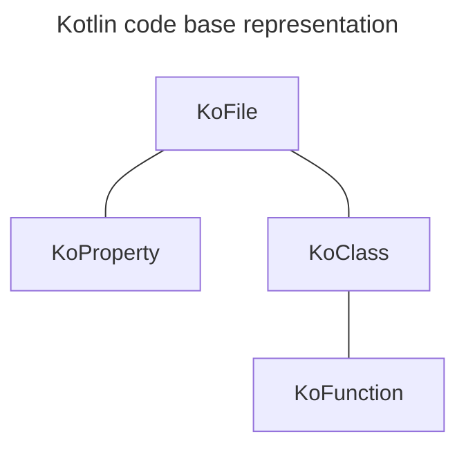

# Declaration

The declaration (`KoDeclaration`) represents a code entity, a piece of Kotlin code. Every parsed Kotlin File (`KoFile`) (usually) contains multiple declarations. The declaration can be a package (`KoPackage`), property (`KoProperty`), annotation (`KoAnnotation`), class (`KoClass`), etc.

Consider this Kotlin code snippet file:

```kotlin
private const val logLevel = "debug"

@Entity
open class Logger(val level: String) {
   fun log(message: String) {
   
   } 
}
```

The above snippet is represented by `KoFile`. It contains two top-level declarations - property declaration (`KoProperty`) and class declaration (`KoClass`). The `Logger` class declaration contains a single function (`KoFunction` ) declaration:



Declarations are mimicking the Kotlin file structure. Konsts API provides a way to retrieve every element. To get all functions in all classes inside the file use `.classes().functions()` :

```kotlin
koFile // Sequence<KoFile>
    .classes()  // Sequence<KoClass>
    .functions() // Sequence<KoFunction>
```

Each declaration contains a set of properties to facilitate filtering and verification eg. `KoClass` declaration has `name`,  `modifiers` , `annotations` , `declarations` (containing `KoFunction`) etc. Here is how the name of the function cna be retrieved.

```kotlin
val name = koFile // Sequence<KoFile>
    .classes()  // Sequence<KoClass>
    .functions() // Sequence<KoFunction>
    .first() // KoFunction
    .name // String
    
println(name) // prints: log
```

Although it is possible to retrieve a property of a single declaration usually verification is performed on a collection of declarations matching certain criteria eg. methods annotated with specific annotations or classes residing within a single package. See the [declaration-quering-and-filtering.md](declaration-quering-and-filtering.md "mention") page.

## Additional Declaration Properties

Every declaration has a few additional properties to help to debug and make sure that the correct declarations are accessed:

* `text` - provides declaration text eg. `val property role = "Developer"`
* `location` - provides file path with file name, line, and column e.g. `~\Dev\IdeaProject\SampleApp\src\kotlin\com\sample\Logger:10:5`
* `locationWithText` - provides `location` together with the declaration `text`

