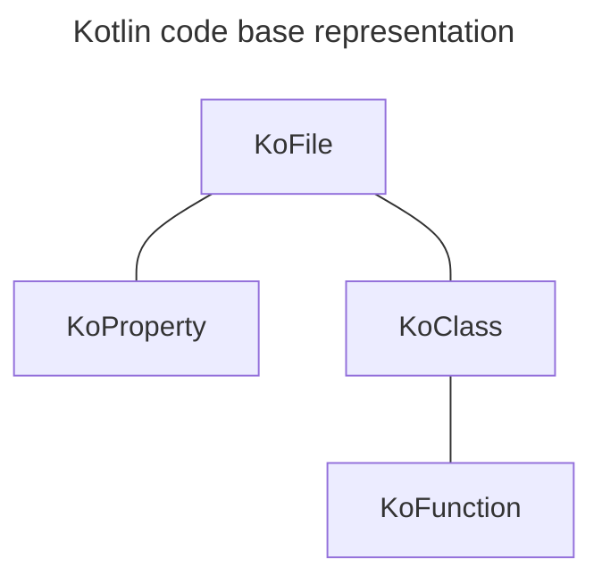

# Declaration

The declaration (`KoDeclaration`) represents a code entity, a piece of Kotlin code. Every parsed Kotlin File (`KoFile`) (usually) contains multiple declarations. The declaration can be a package (`KoPackage`), property (`KoProperty`), annotation (`KoAnnotation`), class (`KoClass`), etc.

Consider this Kotlin code snippet file:

```kotlin
private const val logLevel = "debug"

@Entity
open class Logger(val level: String) {
   fun log(message: String) {
   
   } 
}
```

The above snippet is represented by `KoFile`. It contains two top-level declarations - property declaration (`KoProperty`) and class declaration (`KoClass`). The `Logger` class declaration contains a single function (`KoFunction` ) declaration:



Declarations mimic the Kotlin file structure. Konsts API provides a way to retrieve every element. To get all functions in all classes inside the file using `.classes().functions()` :

```kotlin
koFile // Sequence<KoFile>
    .classes()  // Sequence<KoClass>
    .functions() // Sequence<KoFunction>
```

## Declaration Properties

Each declaration contains a set of properties to facilitate filtering and verification eg. `KoClass` declaration has `name`,  `modifiers` , `annotations` , `declarations` (containing `KoFunction`) etc. Here is how the `name` of the function can be retrieved.

```kotlin
val name = koFile // Sequence<KoFile>
    .classes()  // Sequence<KoClass>
    .functions() // Sequence<KoFunction>
    .first() // KoFunction
    .name // String
    
println(name) // prints: log
```

Although it is possible to retrieve a property of a single declaration usually verification is performed on a collection of declarations matching certain criteria eg. methods annotated with specific annotations or classes residing within a single package. See the [declaration-quering-and-filtering.md](declaration-quering-and-filtering.md "mention") page.

## Debugging Declaration Properties

Each declaration exposes a few additional properties to help with debugging:

* `text` - provides declaration text eg. `val property role = "Developer"`
* `location` - provides file path with file name, line, and column e.g. `~\Dev\IdeaProject\SampleApp\src\kotlin\com\sample\Logger:10:5`
* `locationWithText` - provides `location` together with the declaration `text`

## Explicit Declarations

The primary focus of Konsist API is to reflect the state of the Kotlin source code (that will be verified), not the state of the running program. In some cases, Konsist provides additional API to get more information, but it will have less understanding than Kotlin compiler. Let's take a look at a few examples.

### Class Example

Consider this class:&#x20;

```kotlin
class Logger
```

Is `Logger` class `public`? Yes obviously it is `public`, however, the `hasPublicModifier` method returns the `false` value:

```
koClass.hasPublicModifier() // false
```

Why is that? The `public` visibility modifier is the default visibility modifier in Kotlin. Meaning that class will be `public` even if it does not have the explicit `public` modifier. Since the class has no `public` modifier the `hasPublicModifier` method returns false. To distinguish between class being `public` and class heaving explicit`public` modifier Konsist API provides another method to verify visibility:

```
koClass.isPublicOrDefault() // true
```

### Primary Constructor Example

Let's look at the primary constructor for the same class:

```kotlin
class Logger
```

The `Logger` the class has a primary constructor because the Kotlin compiler will generate a parameterless constrictor under the hood. However, the Konsist API will return `null` a value  because the primary constructor is not present in the code:

```
koClass.primaryConstructor // null
```

### Function Return Type Example

Consider this function:

```
fun getName() = "Konsist"
```

Kotlin will infer `String` as `getName` function return type. Since the code does not contain the explicit return type Konsist can't determine the exact type.  In this scenario, `hasReturnType` will return the `false` value:

```kotlin
koFunction.hasReturnType() // false
```

Unlike the previous class example, Konsist has no way to determine the actual function return type.

###


connstructor





*
  * descripe n declaration with type = no type in code no type, no package no package (it exists withing the package, btu code does nto contain package declaration)



