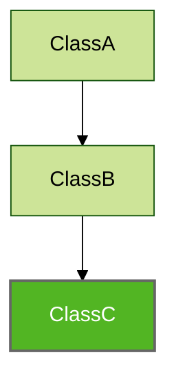

# Indirect Parents

The `indirectParents` parameter  (`parents()`, `hasParentClass()`, `hasAllParentInterfacesOf` methods etc.). specifies whether or not to retrieve parent of the parent (indirect parents). By default, `indirectParents` is `false` e.g.



For above inheritance hierarchy is possible to retrieve:

1. Direct parents of `ClassC` (`ClassB`):

```kotlin
Konsist
	.scopeFromProject()
	.classes()
	.first { it.name == "ClassC" }
	.parents() // ClassB
```

2. All parents present in the codebase hierarchy (`ClassB` and `ClassC`):

```
Konsist
	.scopeFromProject()
	.classes()
	.first { it.name == "SampleClass" }
	.parents(indirectParents = true) // ClassB, ClassA
```

Notice that only parents existing in the project code base are returned.
