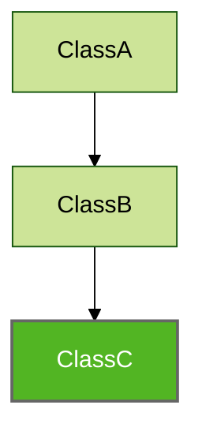

# Indirect Parents

The `indirectParents` parameter has been added to parent retrieval methods (`parents()`, `hasParentClass()`, `hasAllParentInterfacesOf` etc.). This parameter specifies whether or not to include parents such as parent of the parent. By default, `indirectParents` is `false` e.g.




For above inheritance hierarchy is possible to retrieve:

1. direct parents of `ClassC` (`ClassB`):

```kotlin
Konsist
	.scopeFromProject()
	.classes()
	.first { it.name == "ClassC" }
	.parents() // returns listOf(ClassB)
```

2. All (indirect) parents present in the codebase (`ClassB` and `ClassC`):

```
Konsist
	.scopeFromProject()
	.classes()
	.first { it.name == "SampleClass" }
	.parents(indirectParents = true) // returns listOf(ClassB, ClassA)
```
