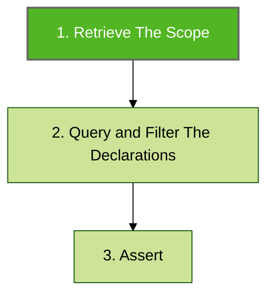
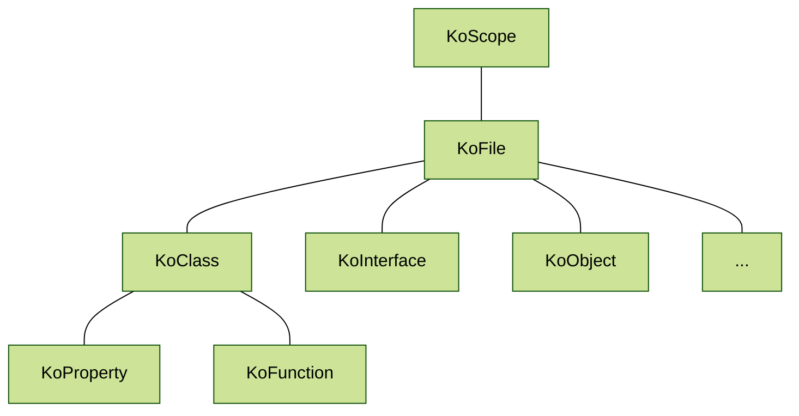

# Retrieve The Scope

The [KoScope](https://github.com/LemonAppDev/konsist/blob/main/src/main/kotlin/com/lemon/konsist/core/declaration/KoScope.kt) class is the entry point to the Konsist library. It is the first step in defining the Konsist test. Scope represents a set of Kotlin files to be further queried, filtered ([query-and-filter-declarations.md](query-and-filter-declarations.md "mention")), and verified ([assert.md](assert.md "mention")).



Every scope contains a set of declarations ([declaration.md](declaration.md "mention")):




Konsist is built on top of [Kotlin Compiler Psi](https://github.com/JetBrains/kotlin/tree/master/compiler/psi/src/org/jetbrains/kotlin/psi). It wraps the Kotlin compiler parser and provides a simple API to access Kotlin code base declarations. Konsist  [declaration.md](declaration.md "mention") tree mimics the Kotlin code structure:


The scope can be created for an entire project, module, package, and a single Kotlin file.&#x20;


To print a list of files within `koScope` use the `koScope.print()` method.


The scope is created using Kotlin files present in the project, so the scope will contain more files as the project grows e.g. if the scope represents a single module then every file added to the module will be part of the scope.

## Scope Creation

### Entire Project Scope

The widest scope is the scope containing all Kotlin files present inside the project:

```kotlin
KoScope.fromProject() // All Kotlin files present in the project
```

### Module Scope

The `module` argument allows the creation of more granular scopes based on the module name e.g. create a scope containing all Kotlin files present in the `app` module:

```kotlin
KoScope.fromProject(module = "app")
```

Selection:

```
project/ 
├─ app/   <--- scope contains all files from the 'app' module
│  ├─ main/
│  │  ├─ App.kt
│  ├─ test/
│  │  ├─ AppTest.kt
├─ core/
│  ├─ main/
│  │  ├─ Core.kt
│  ├─ test/
│  │  ├─ CoreTest.kt
```

### Source Set Scope

The `sourceSet` argument allows the creation of more granular scopes base on the source set name e.g. create a scope containing all Kotlin files present in the `test` source set:

```kotlin
KoScope.fromProject(sourceSet = "test")
```

Selection:

```
project/ 
├─ app/
│  ├─ main/
│  │  ├─ App.kt
│  ├─ test/   <--- scope contains all files the 'test' directory
│  │  ├─ AppTest.kt
├─ core/
│  ├─ main/
│  │  ├─ Core.kt
│  ├─ test/   <--- scope contains all files the 'test' directory
│  │  ├─ CoreTest.kt
```

### Production Codebase

The `fromProjectCodebase` method allows the creation of a scope containing only a production code:

```kotlin
KoScope.fromProject()
```

Selection:

```
project/ 
├─ app/
│  ├─ main/   <--- scope contains all production code files
│  │  ├─ App.kt
│  ├─ test/
│  │  ├─ AppTest.kt
├─ core/
│  ├─ main/   <--- scope contains all production code files
│  │  ├─ Core.kt
│  ├─ test/
│  │  ├─ CoreTest.kt
```

### Test Codebase

The `fromTestCodebase` method allows the creation of a scope containing only a test code:

```kotlin
KoScope.fromTest()
```

Selection:

```
project/ 
├─ app/
│  ├─ main/
│  │  ├─ App.kt
│  ├─ test/   <--- scope contains all test code files
│  │  ├─ AppTest.kt
├─ core/
│  ├─ main/
│  │  ├─ Core.kt
│  ├─ test/   <--- scope contains all test code files
│  │  ├─ CoreTest.kt
```

### Package Scope

The `fromPackageCodebase` method allows the creation of a scope containing code present in a given package e.g. `com.usecase` package:

```kotlin
KoScope.fromPackage("com.usecase..")
```

Selection:

```
project/ 
├─ app/
│  ├─ main/
│  │  ├─ com/
│  │  │  ├─ usecase/
│  │  │  │  ├─ UseCase.kt <--- scope contains files present from 'com.usecase' package kon
│  ├─ test/
│  │  ├─ com/
│  │  │  ├─ usecase/
│  │  │  │  ├─ UseCaseTest.kt <--- scope contains files present from 'com.usecase' package
```


The double dots (`..`) syntax means zero or more packages. Check the [packageselector.md](packageselector.md "mention") page.


### Path Scope ko

The `fromProjectPathCodebase` method allows the creation of a scope containing code present in a given project folder e.g. `domain` folder:

```kotlin
val myScope = KoScope.fromProjectPath("app/domain/")
```

Selection:

```
project/ 
├─ app/
│  ├─ main/
│  │  ├─ com/
│  │  │  ├─ domain/  <--- scope contains files present in 'domain' folder
```


The `fromPathCodebase` method allows the creation of a scope containing code present in any path including a folder located outside of the project folder.


## File Scope

It is also possible to create scope from a single file:

```kotlin
val myScope = KoScope.fromProjectFile("app/main/domain/UseCase.kt")
```


The `fromFile` method allows the creation of a scope containing a single file code present in any path including a file located outside of the project folder.


## Scope Slice

For even more granular control you can use the `KoScope.slice` method to retrieve a scope containing a subset of files from the scope:

```kotlin
// scope containing all files in the 'test' folder
koScope.slice { it.relativePath.contains("/test/") }

// scope containing all files in 'com.domain.usecase' package
koScope.slice { it.hasImport("com.domain.usecase") }

// scope containing all files in 'usecase' package and its sub-packages
koScope.slice { it.hasImport("usecase..") }
```

The `KoScope` can be printed to display a list of all files present in the scope. Here is an example:

## Scope Reuse

Creating scope for every individual test may lead to maintenance penalties:

<pre class="language-kotlin"><code class="lang-kotlin">// Test.kt
class DataTest {
<strong>    @Test
</strong>    fun `test 1`() {
        KoScope
            .fromProject() // Create a new KoScope
            .classes()
            .assert { // .. } 
    }

    fun `test 2`() {
        KoScope
            .fromProject() // Create a new KoScope
            .classes()
            .assert { // .. } 
    }
}
</code></pre>

Instead of creating a scope for every individual test define a scope per test class or per entire test source set.

### Scope Per Test Class

To reuse scope across the test class define the scope in the companion object and access it from multiple tests:

<pre class="language-kotlin"><code class="lang-kotlin">// Test.kt
class DataTest {
<strong>    @Test
</strong>    fun `test 1`() {
        projectScope
            .classes()
            .assert { // .. } 
    }

    fun `test 2`() {
        projectScope
            .classes()
            .assert { // .. } 
    }
    
    companion object {
        // Create a new KoScope once for all tests
        private val projectScope = Konsist.scopeFromProject()
    }
}
</code></pre>

### Global Per Test Source Set

To reuse scope across the multiple test classes define the scope in the file and and access it from multiple tests classes:

```kotlin
// Scope.kt
val projectScope = KoScope.fromProject() // Create a new KoScope

// AppTest.kt
class AppKonsistTest {    
    @Test
    fun `test 1`() {
        projectScope
            .objects()
            .assert { // .. } 
    }
}

// DataTest.kt
class CoreKonsistTest {    
    @Test
    fun `test 1`() {
        projectScope
            .classes()
            .assert { // .. } 
    }

    fun `test 2`() {
        projectScope
            .interfaces()
            .assert { // .. } 
    }
}
```

Here is the file structure representing the above snippet:

```
project/ 
├─ app/
│  ├─ test/
│  │  ├─ app
│  │     ├─ AppKonsistTest.kt
│  │  ├─ core
│  │     ├─ CoreKonsistTest.kt
│  │  ├─ Scope.kt   <--- Instance of the KoScope used in both DataTest and AppTest classes.
```

## Scope Composition

It is possible to compose scopes using Kotlin operators:

```kotlin
// add scopes
val allKoScope = productionScope + testScope

// subtract scopes
val outerLayersScope = allLayersScope - domainLayerScope
```

## Print Scope

To print all files within the scope use the `print()` method:

```kotlin
koScope.print()
```

## Access Specific Declarations

To access specific declaration types such as interfaces, classes, constructors, functions, etc. utilize the [query-and-filter-declarations.md](query-and-filter-declarations.md "mention").
