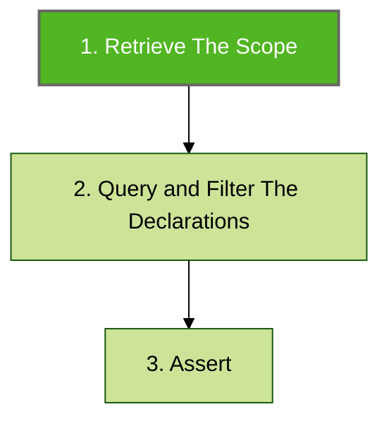
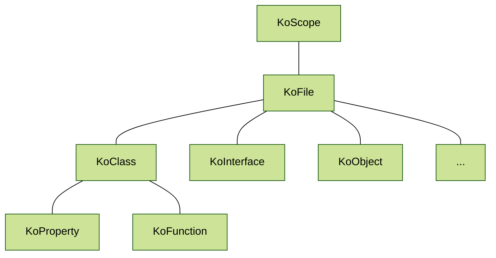

# Scope

The [KoScope](https://github.com/LemonAppDev/konsist/blob/main/src/main/kotlin/com/lemon/konsist/core/declaration/KoScope.kt) class is the entry point to the Konsist library. It is the first step in defining the Konsist test. Scope represents a set of Kotlin files to be further queried, filtered ([declaration-quering-and-filtering.md](declaration-quering-and-filtering.md "mention")) and verified ([assert.md](assert.md "mention")).



Every scope contains a set of declarations ([declaration.md](declaration.md "mention")):



The scope can be created for a single Kotlin file, folder, package, module, or entire project. The scope is created before running the test, so it always contains up-to-date project files.

## Scope Creation

The `KoScope` class allows creating scope containing all Kotlin files present in the project:

```kotlin
KoScope.fromProjectFiles() // All Kotlin files present in the project
```

The `module` and `sourceSet` arguments allow to the creation of more granular scopes:

```kotlin
KoScope.fromProjectFiles(module = "app") // All Kotlin files present in the "app" module
KoScope.fromProjectFiles(sourceSet = "test") // All Kotlin files present in the "test" source sets
```

### More Granular Scopes

More granular scopes such as module scope or package scope can be defined to store different subsets of project files e.g.

* scope representing production code
* scope representing for test code
* scope representing specific application layer
* ...

Here is an example of creating scopes for production code and test code:

```kotlin
KoScope.fromProjectTestFiles() // All Kotlin files present test source sets
KoScope.fromProjectProductionFiles() // All Kotlin files present production source sets
```

Here is an example of creating scope for all files stored in `usecase` package:

```kotlin
val myScope = KoScope.fromPackage("..usecase..")
```

> You can read more about package selector in [PackageSelector.md](packageselector.md).

Here is an example of creating scope for all files stored in `domain` folder\`:

```kotlin
val myScope = KoScope.fromPath("/domain")
```

It is also possible to create scope from a single file:

```kotlin
val myScope = KoScope.fromFile("/domain/UseCase.kt")
```

For even more granular control you can use the `KoScope.slice` method to retrieve a scope containing a subset of files from the scope:

```kotlin
// scope containing all files in the 'test' folder
koScope.slice { it.relativePath.contains("/test/") }

// scope containing all files in 'com.domain.usecase' package
koScope.slice { it.hasImport("com.domain.usecase") }

// scope containing all files in 'usecase' package and its sub-packages
koScope.slice { it.hasImport("usecase..") }
```

The `KoScope` can be printed to display a list of all files present in the scope. Here is an example:

```kotlin
println(koScope)
```

## Scope Reuse

Avoid creating scope for every individual test:

<pre class="language-kotlin"><code class="lang-kotlin">// Test.kt
class DataTest {
<strong>    @Test
</strong>    fun `test 1`() {
        KoScope
            .fromProject() // Create a new KoScope
            .classes()
            .assert { // .. } 
    }

    fun `test 2`() {
        KoScope
            .fromProject() // Create a new KoScope
            .classes()
            .assert { // .. } 
    }
}
</code></pre>

To facilitate testing maintenance scopes should be reused across tests. It is possible by creating a public property and access it from multiple tests:

```kotlin
// Scope.kt
val projectScope = KoScope.fromProject() // Create a new KoScope

// DataTest.kt
class DataKonsistTest {    
    @Test
    fun `test 1`() {
        projectScope
            .classes()
            .assert { // .. } 
    }

    fun `test 2`() {
        projectScope
            .interfaces()
            .assert { // .. } 
    }
}

// AppTest.kt
class AppKonsistTest {    
    @Test
    fun `test 1`() {
        projectScope
            .objects()
            .assert { // .. } 
    }
}
```

Here is the file structure representing the above snippet:

```
tests/
├─ data/
│  ├─ DataKonsistTest.kt
├─ app/
│  ├─ AppKonsistTest.kt
├─ Scope.kt   <--- Instance of the KoScope used in both DataTest and AppTest classes.
```

## Scope Composition

It is possible to compose scopes using Kotlin operators:

```kotlin
// add scopes
val allKoScope = productionScope + testScope

// subtract scopes
val outerLayersScope = allLayersScope - domainLayerScope
```

## Access Specific Declarations

To access specific declaration types such as interfaces, classes, constructors, functions etc. utilize the [declaration-quering-and-filtering.md](declaration-quering-and-filtering.md "mention").
