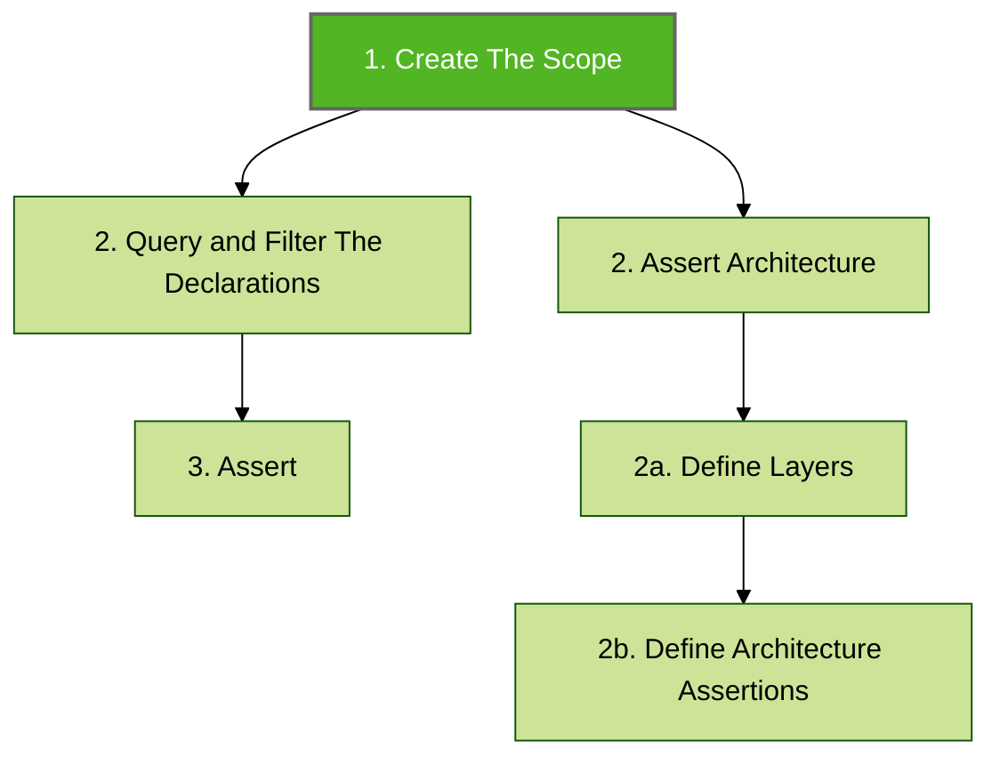
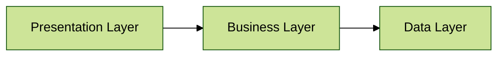

# Getting Started

The following example provides the minimum setup for defining and running a single Konsist test.


Starter (preconfigured) projects containing Konsist tests are available [here](https://github.com/LemonAppDev/konsist/tree/main/samples/starter-projects).


### Add Maven Central Repository

Add `mavenCentral` repository:

```
repositories {
    mavenCentral()
}
```

### Add Konsist Dependency

To use Konsist, include the Konsist dependency from Maven Central:



Add the following dependency to the `module\build.gradle.kts` file:

```kotlin
dependencies {
    testImplementation("com.lemonappdev:konsist:0.17.0")
}
```



Add the following dependency to the `module\build.gradle` file:

```groovy
dependencies {
    testImplementation "com.lemonappdev:konsist:0.17.0"
}
```



Add the following dependency to the `module\pom.xml` file:

```xml
<dependency>
    <groupId>com.lemonappdev</groupId>
    <artifactId>konsist</artifactId>
    <version>0.17.0</version>
    <scope>test</scope>
</dependency>
```




To achieve better test separation Konsist can be configured inside a custom`konsistTest` source set or a dedicated `konsistTest` module. See [isolate-konsist-tests.md](../../advanced/isolate-konsist-tests.md "mention") for guidelines on how to store Konsist test in project codebase and how to run them using cmd.


At a high-level Konsist check is a Unit test following multiple implicit steps.

3 steps are required for a _declaration check_ and 4 steps are required for an _architecture check_:




The declaration represents Kotlin declaration eg. Kotlin class is represented by `KoClassDeclaration` allowing to access class name (`koClassDeclaration.name`), methods (`koClassDeclaration.functions()`), etc. See [declaration.md](../../features/declaration.md "mention").


### Create The Scope

The first step is to get a list of Kotlin files to be verified. This step is common for declaration checks and architecture checks.

The `Konsist` object is an entry point to the Konsist framework. The `scopeFromProject` method obtains the instance of the scope containing all Kotlin project files present in the project:

```kotlin
Konsist.scopeFromProject() // Define the scope containing all Kotlin files present in the project
```


To define more granular scopes see the [koscope.md](../../writing-tests/koscope.md "mention") page.


The following sections will present how to use a scope by writing declaration checks and architecture checks.

## Declaration Check

Let's write a simple test to verify that classes (class declarations) annotated with the `RestController` annotation resides in `controller` package.

### Query and Filter Declarations

To write this declaration check query all classes present in the scope:

```kotlin
Konsist.scopeFromProject()
    .classes() // Get scope classes

```

Perform additional filtering to get classes annotated with `RestController` annotation:

```kotlin
Konsist.scopeFromProject()
    .classes()
    .withAllAnnotationsOf(RestController::class) // Filter classes annotated with 'RestController'
```


To perform more advanced querying and filtering see the [declaration-query-and-filter.md](../../writing-tests/declaration-query-and-filter.md "mention")page.


### Assert

Assert is the final step to perform declaration verification - use `assert` combined with `koClass.resideInPackage` method to make sure that all classes (filtered in the previous step) reside in `controller` package:

```kotlin
Konsist.scopeFromProject()
    .classes()
    .withAllAnnotationsOf(RestController::class)
    .assertTrue { it.resideInPackage("..controller") } // Define the assertion
```


To learn more about assertions see [declaration-assert.md](../../writing-tests/declaration-assert.md "mention") page.



The double dot syntax (`..)` means zero or more packages - controller package preceded by any number of packages (see[packageselector.md](../../features/packageselector.md "mention") syntax).


### Wrap Konsist Code In Test

The above code describes declaration consistency logic. To guard this logic (and ideally, check it with every [Pull Request](https://docs.github.com/en/pull-requests/collaborating-with-pull-requests/proposing-changes-to-your-work-with-pull-requests/about-pull-requests)) it will be executed in the form of a test. Konsist code can be wrapped in the test using popular testing frameworks:



```kotlin
class ControllerClassKonsistTest {
    @Test
    fun `classes annotated with 'RestController' annotation reside in 'controller' package`() {
        Konsist.scopeFromProject() // 1. Create a scope representing the whole project (all Kotlin files in project)
            .classes() // 2. Get scope classes
            .withAllAnnotationsOf(RestController::class) // 2. Filter classes annotated with 'RestController'
            .assertTrue { it.resideInPackage("..controller..") } // 3. Define the assertion
    }
}
```


The [JUnit](https://junit.org/) testing framework project dependency should be added to the project. See [starter projects](https://github.com/LemonAppDev/konsist/tree/main/samples/starter-projects) to get a complete sample project.




```kotlin
class ControllerClassKonsistTest : FreeSpec({
    "classes annotated with 'RestController' annotation reside in 'controller' package" {
        Konsist.scopeFromProject() // 1. Create a scope representing the whole project (all Kotlin files in project)
            .classes() // 2. Get scope classes
            .withAllAnnotationsOf(RestController::class) // 2. Filter classes annotated with 'RestController'
            .assertTrue (
                testName = this.testCase.name.testName
            ) { 
                it.resideInPackage("..controller..") 
            } // 3. Define the assertion
    }
})
```


For Kotest to function correctly the Kotest test name has to be explicitly passed. See the[kotest-support.md](kotest-support.md "mention") page.



The [Kotest](https://kotest.io/) testing framework project dependency should be added to the project. See [starter projects](https://github.com/LemonAppDev/konsist/tree/main/samples/starter-projects) to get a complete sample project.




The above snippets present a complete example of a test verifying that all classes annotated with `RestController` annotation reside in the `controller` package. Since scope is created from all project files this test will verify existing and new classes.

Notice that test class has a `KonsistTest` suffix. This is the recommended approach to name Konsist tests.


Review the [snippets](../../inspiration/snippets/ "mention") for more examples of `declaration checks`.



The above test will execute multiple assertions per test (all controllers will be verified in a single test). If you prefer better isolation each assertion can be executed as a separate test. See the[dynamic-konsist-tests.md](../../advanced/dynamic-konsist-tests.md "mention") page.&#x20;


## Architectural Check

Let's write a simple test to verify that application architecture rules are preserved. In this scenario, the application follows a simple 3-layer architecture, where `Presentation` layer depends on `Business` layer and `Business` layer depends on `Data` layer. The `Data` layer has no layer dependencies:



### Assert Architecture

Use `assertArchiteture` method combined with architecture definition to make sure that all classes meet architectural criteria:

```kotlin
Konsist
    .scopeFromProject()
    .assertArchitecture { // Assert architecture

    }
```

### Define Layers

Create layers instances to represent project layers. Each `Layer` instance accepts the `name` (used for presenting architecture violation errors) and `package` used to define layers.

```kotlin
Konsist
    .scopeFromProject()
    .assertArchitecture {
        // Define layers
        private val presentation = Layer("Presentation", "com.myapp.presentation..")
        private val business = Layer("Business", "com.myapp.business..")
        private val data = Layer("Data", "com.myapp.data..")
    }
```

The presence of two dots at the end signifies that the layer is encompassed by the `com.myapp.business` package along with its sub-packages.

### Define Architecture Assertions

The final step is to define the relations between each layer:

```kotlin
Konsist
    .scopeFromProject()
    .assertArchitecture {
        private val presentation = Layer("Presentation", "com.myapp.presentation..")
        private val business = Layer("Business", "com.myapp.business..")
        private val data = Layer("Data", "com.myapp.data..")

        // Define architecture assertions
        presentation.dependsOn(business)
        business.dependsOn(data)
        data.dependsOnNothing()
    }
```

### Wrap Konsist Code In Test

The above code describes architecture consistency logic. Same as with the declaration check this logic should be executed as a unit test using you preferred testing framework:



```kotlin
class ArchitectureKonsistTest {
    @Test
    fun `architecture layers have dependencies correct`() {
        Konsist
            .scopeFromProject() // Define the scope containing all Kotlin files present i
            .assertArchitecture { // Assert architecture
                // Define layers
                private val presentation = Layer("Presentation", "com.myapp.presentation..")
                private val business = Layer("Business", "com.myapp.business..")
                private val data = Layer("Data", "com.myapp.data..")
    
                // Define architecture assertions
                presentation.dependsOn(business)
                business.dependsOn(data)
                data.dependsOnNothing()
            }
    }
}
```


The [JUnit](https://junit.org/) testing framework project dependency should be added to the project. See [starter projects](https://github.com/LemonAppDev/konsist/tree/main/samples/starter-projects) to get a complete sample project.




```kotlin
class ArchitectureKonsistTest {
    class UseCaseTest : FreeSpec({
        "architecture layers have dependencies correct" {
            Konsist
                .scopeFromProject() // Define the scope containing all Kotlin files present i
                .assertArchitecture() { // Assert architecture
                    // Define layers
                    val presentation = Layer("Presentation", "com.myapp.presentation..")
                    val business = Layer("Business", "com.myapp.business..")
                    val data = Layer("Data", "com.myapp.data..")

                    // Define architecture assertions
                    presentation.dependsOn(business)
                    business.dependsOn(data)
                    data.dependsOnNothing()
                }
        }
    })
}
```


For Kotest to function correctly the Kotest test name has to be explicitly passed. See the[kotest-support.md](kotest-support.md "mention") page.



The [Kotest](https://kotest.io/) testing framework project dependency should be added to the project. See [starter projects](https://github.com/LemonAppDev/konsist/tree/main/samples/starter-projects) to get a complete sample project.





For more Konsist architectural checks see [Protect Kotlin Project Architecture Using Konsist](https://proandroiddev.com/protect-kotlin-project-architecture-using-konsist-3bfbe1ad0eea) article.


## Running Konsist Tests

Run Konsist tests in a same way as other (`JUnit`/`KoTest`) tests in your project. For multi module configuration see [#running-konsist-tests](./#running-konsist-tests "mention").

## Summary

This is the basic way of using Konsist. Take a look at this guide describing how to debug Konsist tests [debug-konsist-test.md](../../features/debug-konsist-test.md "mention") to get a better understanding of how Konsist works.

Please review the Konsist documentation (this website) to read about more advanced topics and various use cases.
