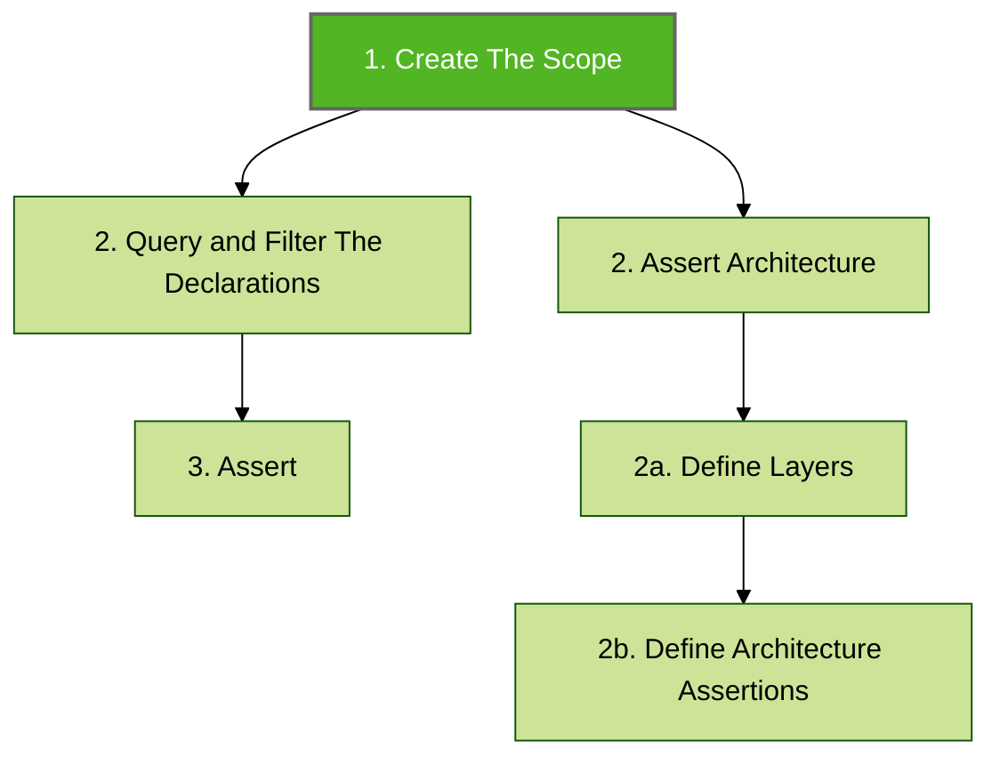

# Getting Started

The following example provides the minimum setup for defining and running a single Konsist test.


Check the [starter projects](https://github.com/LemonAppDev/konsist/tree/main/samples/starter-projects) containing Konsist tests or review the [Konsist API reference](https://reference.konsist.lemonappdev.com).


###

At a high-level Konsist check is a Unit test following multiple implicit steps.

3 steps are required for a _declaration check_ and 4 steps are required for an _architecture check_:


The declaration represents Kotlin declaration eg. Kotlin class is represented by `KoClassDeclaration` allowing to access class name (`koClassDeclaration.name`), methods (`koClassDeclaration.functions()`), etc. See [declaration.md](../../features/declaration.md "mention").


###

##

##
