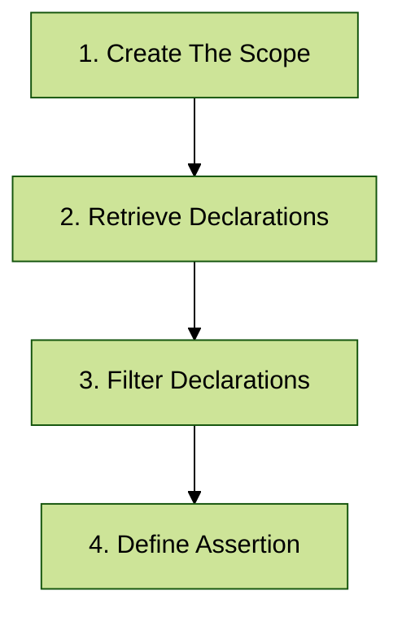

# Create First Konsist Test - Declaration Check

Konsist `Declaration Checks` provide a powerful mechanism for validating the structural elements of the Kotlin codebase. These checks allow developers to enforce structural rules and coding conventions by verifying classes, interfaces, functions, properties, and other code declarations. Here few things that can be verified with Konsist:

* All Use cases should reside in `usecase` specific package
* Repository classes must implement Repository interface
* All repository classes should have name ending with `Repository`
* `data` classes should have only val properties
* Test classes should have test subject named `sut`
* ...


See [snippets](../../inspiration/snippets/ "mention")section for more examples.


## Write First Declaration Check

Let's write a simple test to verify that all classes (all class declarations) residing in resides in `controller` package are annotated with the `RestController` annotation .

### Overview

On a high level writing Konsist `declaration check` requires 4 steps:



Let's take a closer look at each of these steps.

### 1. Create The Scope

The first step is to get a list of Kotlin files to be verified.&#x20;

The `Konsist` object is an entry point to the Konsist library.&#x20;

```kotlin
Konsist
```

The `scopeFromX` methods obtains the instance of the scope containing Kotlin project files. To get all Kotlin project files present in the project use the `scopeFromProject` method:

```kotlin
 // Define the scope containing all Kotlin files present in the project
Konsist.scopeFromProject() //Returns KoScope
```


To define more granular scopes such as scope from production code or scope from single module see the [koscope.md](../../writing-tests/koscope.md "mention") page.


### 2. Retrieve Declarations

Each file in the scope contains set of declarations like classes, properties functions etc. (see [declaration.md](../../features/declaration.md "mention")). To write this declaration check for all classes present in the scope query classes using `classes` method :

```kotlin
Konsist.scopeFromProject()
    // Get scope classes
    .classes() 

```

### 3. Filter Declarations

In this project controllers are defined as classes annotated with `RestController` annotation. Use `withAllAnnotationsOf` method to filter classes with with `RestController` annotation:

```kotlin
Konsist.scopeFromProject()
    .classes()
    // Filter classes annotated with 'RestController'
    .withAllAnnotationsOf(RestController::class) 
```


To perform more granular querying and filtering see the [declaration-query-and-filter.md](../../writing-tests/declaration-query-and-filter.md "mention")page.


### 4. Define Assertion

To performa assertion use the `assertTrue` method:

```kotlin
Konsist.scopeFromProject()
    .classes()
    .withAllAnnotationsOf(RestController::class)
    .assertTrue { 
        // Define the assertion
    } 
```

To verify that classes are located in the `controller` package, use the `resideInPackage` method inside `assertTrue` block:

```kotlin
Konsist.scopeFromProject()
    .classes()
    .withAllAnnotationsOf(RestController::class)
    .assertTrue { 
       // Check if classes are located in the controller package
        it.resideInPackage("..controller") 
    } 
```

This verification applies to the entire collection of previously filtered classes, rather than examining just one class in isolation.


To learn more about assertions see [declaration-assert.md](../../writing-tests/declaration-assert.md "mention") page.



The double dot syntax (`..)` means zero or more packages - controller package preceded by any number of packages (see[packageselector.md](../../features/packageselector.md "mention") syntax).


## Wrap Konsist Code In Test

The declaration validation logic should be protected through automated testing. By wrapping Konsist checks within standard testing frameworks such as [JUnit](https://junit.org) or [KoTest](https://kotest.io/), you can verify these rules with each [Pull Request](https://docs.github.com/en/pull-requests/collaborating-with-pull-requests/proposing-changes-to-your-work-with-pull-requests/about-pull-requests):



```kotlin
class ControllerClassKonsistTest {
    @Test
    fun `classes annotated with 'RestController' annotation reside in 'controller' package`() {
      // 1. Create a scope representing the whole project (all Kotlin files in project)
            Konsist.scopeFromProject()
            // 2. Retrieve class declarations
            .classes()
            // 3. Filter classes annotated with 'RestController'
            .withAllAnnotationsOf(RestController::class)
            // 4. Define the assertion
            .assertTrue { it.resideInPackage("..controller..") }
    }
}
```


The [JUnit](https://junit.org) testing framework project dependency should be added to the project. See [starter projects](https://github.com/LemonAppDev/konsist/tree/main/samples/starter-projects) to get a complete sample project.




```kotlin
class ControllerClassKonsistTest : FreeSpec({
    "classes annotated with 'RestController' annotation reside in 'controller' package" {
         Konsist
            // 1. Create a scope representing the whole project (all Kotlin files in project)
            .scopeFromProject()
            // 2. Retrieve class declarations
            .classes() // 2. Get scope classes
            // 3. Filter classes annotated with 'RestController'
            .withAllAnnotationsOf(RestController::class)
            // 4. Define the assertion
            .assertTrue (testName = this.testCase.name.testName) { 
                it.resideInPackage("..controller..") 
            }
    }
})
```


For Kotest to function correctly the Kotest test name has to be explicitly passed. See the[kotest-support.md](../../features/kotest-support.md "mention") page.



The [Kotest](https://kotest.io/) testing framework project dependency should be added to the project. See [starter projects](https://github.com/LemonAppDev/konsist/tree/main/samples/starter-projects) to get a complete sample project.




Note that test class has a `KonsistTest` suffix. This is the recommended approach to name classes containing Konsist tests.


## Summary

This section described the basic way of writing Konsist declaration test. To get a better understanding of how Konsist API works see [debug-konsist-test.md](../../features/debug-konsist-test.md "mention").&#x20;

The above test will execute multiple assertions per test (all controllers will be verified in a single test). If you prefer better isolation each assertion can be executed as a separate test. See the [dynamic-konsist-tests](../../advanced/dynamic-konsist-tests/ "mention") page.

