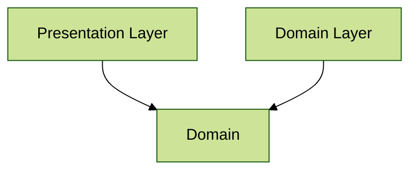
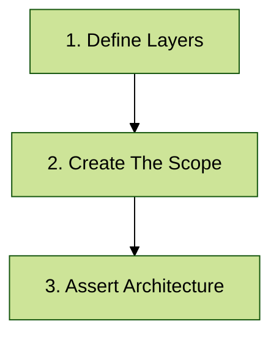

# Create Secound Konsist Test - Architectural Check

Konsist's `Architectural Checks` serve as a robust tool for maintaining layer isolation, enabling development teams to enforce strict boundaries between different architectural layers. Here few things that can be verified with Konsist:

* `domain` layer is independant
* `data` layer depends on domain layer
* ...


See [architecture-snippets.md](../../inspiration/snippets/architecture-snippets.md "mention")section for more examples.


## Write First Architectural Check

Let's write a simple test to verify that application architecture rules are preserved. In this scenario, the application follows a simple 3-layer architecture, where `Presentation` and `Data` layers depend on `Domain` layer and `Domain` layer is independant (from these layers):



### Overview

On a high level writing Konsist `architectural check` requires 3 steps:



Let's take a closer look at each of these steps.

### 1. Define Layers

Create layers instances to represent project layers. Each `Layer` instance accepts the `name` (used for presenting architecture violation errors) and `package` used to define layers.

```kotlin
// Define layers
private val presentationLayer = Layer("Presentation", "com.myapp.presentation..")
private val domainLayer = Layer("Domain", "com.myapp.domain..")
private val dataLayer = Layer("Data", "com.myapp.data..")
```


The double dot syntax (`..)` means zero or more packages - layer is represented by the package and all of it's sub packages (see[packageselector.md](../../features/packageselector.md "mention") syntax).


### 2. Create The Scope

The `Konsist` object is an entry point to the `Konsist` library.&#x20;

```kotlin
Konsist
```

The `scopeFromX` methods obtains the instance of the scope containing Kotlin project files. To get all Kotlin project files present in the project use the `scopeFromProject` method:

```kotlin
// Define layers
private val presentationLayer = Layer("Presentation", "com.myapp.presentation..")
private val domainLayer = Layer("Domain", "com.myapp.domain..")
private val dataLayer = Layer("Data", "com.myapp.data..")
 
// Define the scope containing all Kotlin files present in the project
Konsist.scopeFromProject() //Returns KoScope
```


To define more granular scopes such as scope from production code or scope from single module see the [koscope.md](../../writing-tests/koscope.md "mention") page.


### 3. Assert Architecture

To performa assertion use the `assertArchiteture` method:

<pre class="language-kotlin"><code class="lang-kotlin">// Define layers
private val presentationLayer = Layer("Presentation", "com.myapp.presentation..")
private val domainLayer = Layer("Domain", "com.myapp.domain..")
private val dataLayer = Layer("Data", "com.myapp.data..")

Konsist
    .scopeFromProject()
     // Assert architecture
    .assertArchitecture {
<strong>        // Define architectural rules
</strong>    }
</code></pre>

Utilize `dependsX` methods to validate that your project's layers adhere to the defined architectural dependencies:

```kotlin
Konsist
    .scopeFromProject()
    .assertArchitecture {
        private val presentationLayer = Layer("Presentation", "com.myapp.presentation..")
        private val domainLayer = Layer("Domain", "com.myapp.business..")
        private val dataLayer = Layer("Data", "com.myapp.data..")

        // Define layer dependnecies
        presentationLayer.dependsOn(domainLayer)
        dataLayer.dependsOn(domainLayer)
        domainLayer.dependsOnNothing()
    }
```


Wrap Konsist Code In Test

The declaration validation logic should be protected through automated testing. By wrapping Konsist checks within standard testing frameworks such as [JUnit](https://junit.org) or [KoTest](https://kotest.io/), you can verify these rules with each [Pull Request](https://docs.github.com/en/pull-requests/collaborating-with-pull-requests/proposing-changes-to-your-work-with-pull-requests/about-pull-requests):



```kotlin
class ArchitectureKonsistTest {
    @Test
    fun `architecture layers have dependencies correct`() {
        Konsist
            .scopeFromProject()
            .assertArchitecture {
                private val presentationLayer = Layer("Presentation", "com.myapp.presentation..")
                private val domainLayer = Layer("Domain", "com.myapp.business..")
                private val dataLayer = Layer("Data", "com.myapp.data..")
        
                // Define layer dependnecies
                presentationLayer.dependsOn(domainLayer)
                dataLayer.dependsOn(domainLayer)
                domainLayer.dependsOnNothing()
            }
    }
}
```


The [JUnit](https://junit.org/) testing framework project dependency should be added to the project. See [starter projects](https://github.com/LemonAppDev/konsist/tree/main/samples/starter-projects) to get a complete sample project.




```kotlin
class ArchitectureKonsistTest {
    class UseCaseTest : FreeSpec({
        "architecture layers have dependencies correct" {
            Konsist
                .scopeFromProject()
                .assertArchitecture {
                    private val presentationLayer = Layer("Presentation", "com.myapp.presentation..")
                    private val domainLayer = Layer("Domain", "com.myapp.business..")
                    private val dataLayer = Layer("Data", "com.myapp.data..")
            
                    // Define layer dependnecies
                    presentationLayer.dependsOn(domainLayer)
                    dataLayer.dependsOn(domainLayer)
                    domainLayer.dependsOnNothing()
                }
        }
    })
}
```


For Kotest to function correctly the Kotest test name has to be explicitly passed. See the[kotest-support.md](../../features/kotest-support.md "mention") page.



The [Kotest](https://kotest.io/) testing framework project dependency should be added to the project. See [starter projects](https://github.com/LemonAppDev/konsist/tree/main/samples/starter-projects) to get a complete sample project.




Note that test class has a `KonsistTest` suffix. This is the recommended approach to name classes containing Konsist tests.

## Summary

This section described the basic way of writing Konsist architectural test. To get a better understanding of how Konsist API works see [debug-konsist-test.md](../../features/debug-konsist-test.md "mention").&#x20;
