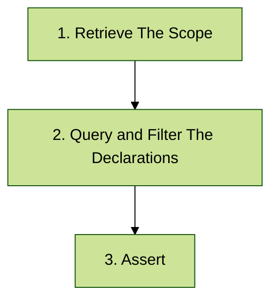

# Quick Start

The following example provides a glimpse at the minimum requirements for writing a test in Konsist. The subsequent pages of this section will provide further details on all available features.


Konsist is compatible with [Spring](https://spring.io/), and [Android](https://www.android.com/). The `Java 8` is a minimum Java version required to run Konsist.


### Add Repository

Add `mavenCentral` repository:

```
repositories {
    mavenCentral()
}
```

### Add Konsist Dependency

To use Konsist, include the Konsist dependency from Maven Central:



Add the following dependency to the `module\build.gradle.kts` file:

```kotlin
dependencies {
    testImplementation(KONSIST_DEPENDENCY)
}
```



Add the following dependency to the `module\build.gradle` file:

```groovy
dependencies {
    testImplementation "com.lemonappdev:konsist:0.7.4"
}
```



Add the following dependency to the `module\pom.xml` file:

```xml
<dependency>
    <groupId>com.lemonappdev</groupId>
    <artifactId>konsist</artifactId>
    <version>0.7.4</version>
    <scope>test</scope>
</dependency>
```



Dependency can be added to other build systems as well. Check the [snippets](https://central.sonatype.com/artifact/com.lemonappdev/konsist) section in the sonatype repository.&#x20;




To achieve better test separation Konsist can be configured inside `konsistTest` source set or dedicated module. See [separate-konsist-tests.md](separate-konsist-tests.md "mention").


## Usage

At a high-level Konsist check is a Unit test that works as follows few steps:



Let's write a simple test to verify that classes annotated with the `RestController` annotation resides in `controller` package.

### 1. Retrieve The Scope

The first step is to get a list of Kotlin files to be verified. The `fromProject` the method can be used to obtain the instance of the scope containing all Kotlin project files:

```kotlin
KoScope.fromProject()
```


To define more granular scopes see the [koscope.md](../features/koscope.md "mention") page.


### 2. Query and Filter Declarations

The next step is to access all of the classes present in the scope:

```kotlin
KoScope.fromProject()
    .classes()

```

Perform additional filtering to get classes annotated with `RestController` annotation:

```kotlin
KoScope.fromProject()
    .classes()
    .withAnnotation<RestController>
```


To perform more advanced querying and filtering see the [query-and-filter-declarations.md](../features/query-and-filter-declarations.md "mention")page.


### 3. Assert

The final step is to perform code base verification - use `assert` combined with  `koClass.resideInPackage` method to make sure that all classes (filtered in the previous step) reside in `controlelr` package:

```kotlin
KoScope.fromProject()
    .classes()
    .withAnnotation<RestController>
    .assert { it.resideInPackage("..controller") }
```


To learn more about assertions see [assert.md](../features/assert.md "mention") page.



The double dot syntax (`..)` means zero or more packages - controller package preceded by any number of packages (see[packageselector.md](../features/packageselector.md "mention") syntax).


### Wrap Konsist Code In Test

The above code describes project consistency logic. To guard this logic (and ideally, check it with every [Pull Request](https://docs.github.com/en/pull-requests/collaborating-with-pull-requests/proposing-changes-to-your-work-with-pull-requests/about-pull-requests)) it must be executed as a unit test:

```kotlin
val koScope = KoScope.fromProject() // Should be shared between tests

class ControllerClassKonsistTest {
    @Test
    fun `classes annotated with 'RestController' annotation reside in 'controller' package`() {
        koScope // 1. Create a scope representing the whole project (all Kotlin files in project)
            .classes() // 2. Get all classes in the project
            .withAnnotation<RestController> // 2. Filter classes annotated with 'RestController'
            .assert { it.resideInPackage("..controller..") } // 3. Define the assertion
    }
}
```

The above snippet presents a complete example of a test verifying that all classes annotated with `RestController` annotation reside in the `controler` package. The test will verify existing nad new classes.


This test is written using [JUnit](https://junit.org/) testing framework, however, Konsist is a test framework agonistic, so any test framework can be used.



Should be shared between tests. See [#scope-reuse](../features/koscope.md#scope-reuse "mention").


For more tests check the samples in the [Broken link](broken-reference "mention") section.

## Pull Request Check

Konsist is intended to run as a PR-level check, similar to other tests and linters.&#x20;

