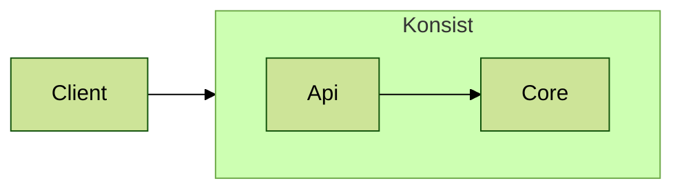

# Contributing

So you want to help? That's great!


To chat with Konsist developers and the Konsist community please check the [#konsist channel](https://kotlinlang.slack.com/archives/C05QG9FD6KS) at `kotlinlang` Slack workspace (preferred), or start a new [GitHub discussion](https://github.com/LemonAppDev/konsist/discussions).


The Konsist project is now at a critical stage where community input is essential to polish and mature it.


This contributing guide is still to be polished, so feel free to [start a new discussion or open an issue](https://github.com/LemonAppDev/konsist/discussions/new/choose) to discuss contributions, features/fixes, and implementation details.


There are a variety of ways to contribute to the Konsit project:

- **Coding:** This is the most common way to contribute. You can fix bugs or add new features.
- **Testing:** You can help to improve the quality by testing the code and reporting bugs. This is a great way to get involved and help out maturing the project.
- **Documentation:** You can help to improve the documentation by writing or editing documentation. This is a great way to help people understand how to use Konsist.
- **Community:** You can answer questions or participate in discussions. This is a great way to connect with other programmers.
- **Spread the word:** You can help to spread the word about the Konsist by talking about it with fellow developers. You can also write a short post or a full-fledged article.

No matter how you choose to contribute, you will be making a valuable contribution to the open-source community.

## Repositories

Konsist project is spread across multiple repositories:

<<<<<<< HEAD

- [Konsist](https://github.com/LemonAppDev/konsist) - repository containing Konist code
- [Konsist-Documentation](https://github.com/LemonAppDev/konsist-documentation) - repository containing Konsist documentation (this webpage)

## Plusings

Some of the project readmes contain [Mermaid](https://mermaid.js.org/) diagrams. For a diagram preview, it is recommended to install the [Mermaid plugin for INTELLIJ IDEA](https://plugins.jetbrains.com/plugin/20146-mermaid/reviews).

## Make A Change In The Konsist Documentation Repository

For most scenarios, open PR in the [konsist-documentation](https://github.com/LemonAppDev/konsist-documentation) repository.&#x20;

### Updating Snippets

The [snippets](../inspiration/snippets/ "mention")section requires a different approach. To ensure the snippets remain current and valid, we store them within the [snippet source set](https://github.com/LemonAppDev/konsist/tree/main/lib/src/snippet/kotlin) of the [Konsist](https://github.com/LemonAppDev/konsist) repository. With every release, new snippet pages are generated to update the GitBook documentation.&#x20;

# Some snippets depend on classes from frameworks, so to allow compilation, we store placeholder classes mimicking the full names of the external framework class e.g. [Inject.kt](https://github.com/LemonAppDev/konsist/blob/main/lib/src/snippet/kotlin/javax/inject/Inject.kt).

- [konsist](https://github.com/LemonAppDev/konsist) - repository containing Konist code
- [konsist-documentation](https://github.com/LemonAppDev/konsist-documentation) - repository containing Konsist documentation (this webpage)
  > > > > > > > f6fba20 (fix some details)

## Make A Change In The Konsist Repository

This is a high-level view of project contribution:

1. Create a fork of the [Konsist](https://github.com/LemonAppDev/konsist) repository
2. Open the project using [IntelliJ IDEA](https://www.jetbrains.com/idea/)
3. Make changes
4. Add Tests if needed
5. Open the `Draft` Pull Request to the `develop` branch
6. Make sure all checks are passing before marking PR as `Ready for review`.


For some contributors, the repo admin may have to approve checks manually for the 1st PR.


## Testing Changes Locally

### Publish Local Konsist Artefact

To test the changes locally you can publish a `SNAPSHOT` artifact of the Konsist to the local maven repository:

```bash
./gradlew publishToMavenLocal -Pkonsist.releaseTarget=local
```

After publishing a new artifact `x.y.z-SNAPSHOT` with the version number will appear in the local Maven repository:

```
Mac: /Users/<user_name>/.m2/repository/com/lemonappdev/konsist
Windows: C:\Users\<User_Name>\.m2\repository\com\lemonappdev\konsist
Linux: /home/<User_Name>/.m2/repository/com/lemonappdev/konsist
```

The actual Konsist version is defined in the [gradle.properties](https://github.com/LemonAppDev/konsist/blob/main/gradle.properties) file. The `SNAPSHOT` suffix will be added automatically to the published artifact.

To use this artifact you have to add a local Maven repository to your project.

### Use Published Artifact From Local Maven Repository

Every project contains a list of the repositories used to retrieve the dependencies. A local Maven repository has to be manually added to the project.



Add the following block to the `build.gradle` / `build.gradle.kts` file:

```kotlin
repositories {
    mavenLocal()
}
```



By default, the Maven project uses a local repository. If not add the following block to the `module\pom.xml` file:

```xml
<repositories>
    <repository>
        <id>local</id>
        <url>file://${user.home}/.m2/repository</url>
    </repository>
</repositories>
```



Dependency can be added to other build systems as well. Check the [snippets](https://central.sonatype.com/artifact/com.lemonappdev/konsist) section in the sonatype repository.



Now build scripts will use the local repository to resolve dependencies, however, the version of Konsist has to be updated to the `SNAPSHOT` version of the newly published artifact e.g.

`com.lemonappdev:konsist:0.12.0-SNAPSHOT`

Now build scripts will be able to resolve this newly published Konsist artifact.

### Verify Used Konsist Artifact Version

IntelliJ IDEA UI provides a convenient way to check which version of Konsist is used by the project. Open the `External Libraries` section of `Project view` and search for Konsist dependency:

 (1).png>)

## Checks

During the PR review, several types of checks are executed using [GitHub Actions](https://github.com/features/actions) ([.github/workflow](https://github.com/LemonAppDev/konsist/tree/main/.github/workflows)). These checks can also be executed locally using the following commands:

- [Spotless](https://github.com/diffplug/spotless) (runs [ktlint](https://github.com/pinterest/ktlint))
  - &#x20;`./gradlew spotlessCheck` - check the code using Spotless
  - &#x20;`./gradlew spotlessApply` - check and fix code using Spotless (if possible)
- [Detekt](https://github.com/detekt/detekt)
  - `./gradlew detektCheck` - check the code using Detekt
  - &#x20;`./gradlew detektApply` - check and fix code using Detekt (if possible)
- Tests
  - `./gradlew lib:test` - run JUnit tests
  - `./gradlew lib:apiTest` - run API tests
  - `./gradlew lib:integrationTest` - run integrations tests
  - `./gradlew lib:konsistTest` - run Konsist tests to test Konsist codebase 🤯😉

## Source Sets

Konsist contains multiple custom source sets (defined by the [JVM Test Suite Plugin](https://docs.gradle.org/current/userguide/jvm_test_suite_plugin.html)) to provide better isolation between various types of tests:

- `test` - tests related to generic Konsist API (everything except the `architectureAssert`)
- `apiTest` - tests related to `architectureAssert`
- `integrationTest` - test classes using custom Kotlin snippets (`.kttxt`) to test the Konsist API
- `konsistTest` - tests Konsist codebase consistency using `konsist` library
- `snippets` - contains Kotlin code snippets, written as methods (tests without `@Test` annotation), so the tests are not executed. These snippets are used to generate documentation. The update-snippets.py script generates PR to update the [snippets](https://docs.konsist.lemonappdev.com/inspiration/snippets) page

We aim to test the majority of aspects within these source sets. However, certain kinds of checks require a dedicated test project. These projects are available in the [test-project](https://github.com/LemonAppDev/konsist/tree/main/test-projects) directory on the Konsist repository.

## Layers

The high-level view of Konsist architecture:



## Make a Change In The Konsist Documentation Repository

The [Konsist Documentation repository](https://github.com/LemonAppDev/konsist-documentation) contains this website. Create a fork of the repository, make changes using any text editor (e.g. [Visual Studio Code](https://code.visualstudio.com/)), and open the Pull Request.
