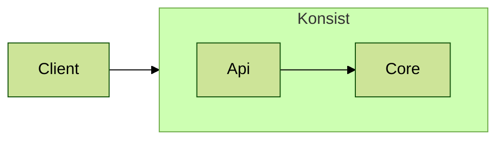

# Contributing

## General

So you want to help? That's great!


To chat with Konsist developers and the Konsist community please check the [#konsist channel](https://kotlinlang.slack.com/archives/C05QG9FD6KS) at `kotlinlang` Slack workspace (preferred), or start a new [GitHub discussion](https://github.com/LemonAppDev/konsist/discussions).


The Konsist project is now at a critical stage where community input is essential to polish and mature it.

There are a variety of ways to contribute to the Konsit project:

* **Coding:** This is the most common way to contribute. You can fix bugs or add new features.
* **Testing:** You can help to improve the quality by testing the code and reporting bugs. This is a great way to get involved and help out maturing the project.
* **Documentation:** You can help to improve the documentation by writing or editing documentation. This is a great way to help people understand how to use Konsist.
* **Community:** You can answer questions or participate in discussions ([GitHub](https://github.com/LemonAppDev/konsist/discussions), [Slack](https://kotlinlang.slack.com/archives/C05QG9FD6KS)). This is a great way to connect with other programmers.
* **Spread the word:** You can help to spread the word about the Konsist by talking about it with fellow developers. You can also write a short post or a full-fledged article. Make sure to let us know at [#konsist](https://kotlinlang.slack.com/archives/C05QG9FD6KS) channel if you do so.

No matter how you choose to contribute, you will be making a valuable contribution to the open-source community.

## Contributing

Our [contributor backlog is public](https://lemonappdev.atlassian.net/issues/?jql=labels%20%3D%20ContributeOpportunity%20and%20status%20in%20%28Open%2C%20%22Board%20Backlog%22%2C%20Backlog%29%20ORDER%20BY%20created%20DESC) in JIRA.&#x20;

The best way to interact with the Konsist team is the dedicated [#konsist-dev](https://kotlinlang.slack.com/archives/C0628CK7TEV) channel ([kotlinlang Slack workspace](https://kotlinlang.slack.com/)). If you want to help or need guidelines just say hello at  [#konsist-dev](https://kotlinlang.slack.com/archives/C0628CK7TEV) Slack channel.

Tickets that can be grabbed by the community have a [ContributeOpportunity](https://lemonappdev.atlassian.net/issues/?jql=labels%20%3D%20ContributeOpportunity%20and%20status%20in%20\(Open%2C%20%22Board%20Backlog%22%2C%20Backlog\)%20ORDER%20BY%20created%20DESC) label. You can also work on another improvement or bug-fix, but this may require more alignment, for example, certain features and planed ahead, so the ticket should be completed within a given time period.

### Start Contributing - Konsist

1. Get contributor JIRA access - send your email in DM to [#igorwojda](https://kotlinlang.slack.com/archives/D2T3KL43X) at [kotlinlang Slack workspace](https://kotlinlang.slack.com/).
2. Pick the ticket in JIRA
3. Assign it to yourself, and update the ticket status to `In Progress`
4. Fork [Konsist ](https://github.com/LemonAppDev/konsist)repository (uncheck "Copy the main branch only")

<figure><figcaption></figcaption></figure>

<figure><figcaption></figcaption></figure>

5. Branch of [develop](https://github.com/LemonAppDev/konsist/tree/develop) branch
6. Implement the changes
7. Add tests (look around in codebase for similar code being tested)
8. Open draft[ Pull Request](https://github.com/LemonAppDev/konsist/compare) with [develop](https://github.com/LemonAppDev/konsist/tree/develop) branch as target ([develop](https://github.com/LemonAppDev/konsist/tree/develop) branch will be merged into the [main](https://github.com/LemonAppDev/konsist/tree/main) branch after the release)
   1. Make sure all checks are passing before marking PR as `Ready for review`.

### Start Contributing - Konsist Docs

The [konsist-documentation](https://github.com/LemonAppDev/konsist-documentation) - repository contains Konsist documentation (this webpage). &#x20;

1. Fork [Konsist-documentation](https://github.com/LemonAppDev/konsist) repository
2. Branch of [main](https://github.com/LemonAppDev/konsist-documentation/tree/main) branch
3. Make changes
4. Open [new Pull Request](https://github.com/LemonAppDev/konsist-documentation/compare) with [main](https://github.com/LemonAppDev/konsist-documentation/tree/main) branch as a target

## Checks

During the PR review, several types of checks are executed using [GitHub Actions](https://github.com/features/actions) ([.github/workflow](https://github.com/LemonAppDev/konsist/tree/main/.github/workflows)). These checks can also be executed locally using the following commands:

* [Spotless](https://github.com/diffplug/spotless) (runs [ktlint](https://github.com/pinterest/ktlint))
  * `./gradlew spotlessCheck` - check the code using Spotless
  * `./gradlew spotlessApply` - check and fix code using Spotless (if possible)
* [Detekt](https://github.com/detekt/detekt)
  * `./gradlew detektCheck` - check the code using Detekt
  * `./gradlew detektApply` - check and fix code using Detekt (if possible)
* Tests
  * `./gradlew lib:test` - run JUnit tests
  * `./gradlew lib:apiTest` - run API tests
  * `./gradlew lib:integrationTest` - run integrations tests
  * `./gradlew lib:konsistTest` - run Konsist tests to test Konsist codebase 🤯😉


Konsist adheres to stringent testing standards. Each Provider undergoes testing against every type of declaration, leading to an extensive set of tests. This thorough testing ensures two main objectives:

1. Guaranteeing future compatibility with Kotlin 2.0.
2. Due to reliance on an external library for parsing, it's imperative to have comprehensive tests to ensure the Konsist API functions as anticipated.


## IntelliJ IDEA Plugins

Some of the project README files contain [Mermaid](https://mermaid.js.org/) diagrams. For a diagram preview, it is recommended to install the [Mermaid plugin](https://plugins.jetbrains.com/plugin/20146-mermaid/reviews).

## Testing Changes Locally

#### Publish Local Konsist Artefact

To test the changes locally you can publish a `SNAPSHOT` artifact of the Konsist to the local maven repository:

```bash
./gradlew publishToMavenLocal -Pkonsist.releaseTarget=local
```

After publishing a new artifact `x.y.z-SNAPSHOT` with the version number will appear in the local Maven repository:

```
Mac: /Users/<user_name>/.m2/repository/com/lemonappdev/konsist
Windows: C:\Users\<User_Name>\.m2\repository\com\lemonappdev\konsist
Linux: /home/<User_Name>/.m2/repository/com/lemonappdev/konsist
```

The actual Konsist version is defined in the [gradle.properties](https://github.com/LemonAppDev/konsist/blob/main/gradle.properties) file. The `SNAPSHOT` suffix will be added automatically to the published artifact.

To use this artifact you have to add a local Maven repository to your project.

#### Use Published Artifact From Local Maven Repository

Every project contains a list of the repositories used to retrieve the dependencies. A local Maven repository has to be manually added to the project.



Add the following block to the `build.gradle` / `build.gradle.kts` file:

```kotlin
repositories {
    mavenLocal()
}
```



By default, the Maven project uses a local repository. If not add the following block to the `module\pom.xml` file:

```xml
<repositories>
    <repository>
        <id>local</id>
        <url>file://${user.home}/.m2/repository</url>
    </repository>
</repositories>
```



Dependency can be added to other build systems as well. Check the [snippets](https://central.sonatype.com/artifact/com.lemonappdev/konsist) section in the sonatype repository.



Now build scripts will use the local repository to resolve dependencies, however, the version of Konsist has to be updated to the `SNAPSHOT` version of the newly published artifact e.g.

`com.lemonappdev:konsist:0.12.0-SNAPSHOT`

Now build scripts will be able to resolve this newly published Konsist artifact.

#### Verify Used Konsist Artifact Version

IntelliJ IDEA UI provides a convenient way to check which version of Konsist is used by the project. Open the `External Libraries` section of `Project view` and search for Konsist dependency:

 (1) (1).png>)

## No Matching Toolchains Found Error

If during a build you encounter an error regarding `No matching toolchains found` then open `Module Settings` / `Project Structure` windows and set Java SDK to version e.g. `19`.

<figure><figcaption></figcaption></figure>

You can install missing JDKs directly from IntelliJ IDEA - click on the `Module SDK` combo box and select `+Add SDK`.

If during the build you encounter an error regarding `Could not determine the dependencies of null.` then open `File` / `Settings` / `Build, Execute, Deployment` / `Build Tools` / `Gradle` window and set Java SDK to version `19`.

<figure><figcaption></figcaption></figure>

## Architecture

### Source Sets

Konsist contains multiple custom source sets (defined by the [JVM Test Suite Plugin](https://docs.gradle.org/current/userguide/jvm\_test\_suite\_plugin.html)) to provide better isolation between various types of tests:

* `test` - tests related to generic Konsist API (everything except the `architectureAssert`)
* `apiTest` - tests related to `architectureAssert`
* `integrationTest` - test classes using custom Kotlin snippets (`.kttxt`) to test the Konsist API
* `konsistTest` - tests Konsist codebase consistency using `konsist` library
* `snippets` - contains Kotlin code snippets, written as methods (tests without `@Test` annotation), so the tests are not executed. These snippets are used to generate documentation. The update-snippets.py script generates PR to update the [snippets](https://docs.konsist.lemonappdev.com/inspiration/snippets) page

We aim to test the majority of aspects within these source sets. However, certain kinds of checks require a dedicated test project. These projects are available in the [test-project](https://github.com/LemonAppDev/konsist/tree/main/test-projects) directory on the Konsist repository.

### Layers

The high-level view of Konsist architecture:



### Make a Change In The Konsist Documentation Repository

The [konsist-documentation](https://github.com/LemonAppDev/konsist-documentation) repository contains this website. Create a fork of the repository, make changes using any text editor (e.g. [Visual Studio Code](https://code.visualstudio.com/)), and open the Pull Request targeting the `main` branch.

#### Updating Snippets

The [snippets](../inspiration/snippets/ "mention")section requires a different approach. To ensure the snippets remain valid and aligned with Konsist API, we store them within the [snippet source set](https://github.com/LemonAppDev/konsist/tree/main/lib/src/snippet/kotlin) of the [konsist](https://github.com/LemonAppDev/konsist) repository. With every release, new snippet pages are generated from the [snippet source set](https://github.com/LemonAppDev/konsist/tree/main/lib/src/snippet/kotlin) and placed in the GitBook documentation ([konsist-documentation](https://github.com/LemonAppDev/konsist-documentation) repository).

Some snippets depend on classes/interfaces/annotations from external frameworks such as Spring `Repository` annotation or Android `ViewModel` class. To avoid coupling Konsist with these frameworks and allow snippet compilation, we store placeholder classes mimicking the full names of the external framework in [this directory](https://github.com/LemonAppDev/konsist/tree/main/lib/src/snippet/kotlin). class e.g. [Inject.kt](https://github.com/LemonAppDev/konsist/blob/main/lib/src/snippet/kotlin/javax/inject/Inject.kt).

