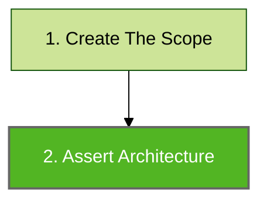
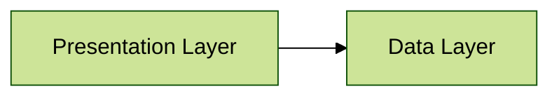

# Architecture Assert

Architecture assertions are used to perform architecture verification. It is the final step of Konsist verification preceded by scope creation ([koscope.md](koscope.md "mention")):



## Assert

As an example this simple 2 layer architecture will be used:



The `assertArchitecture` block defines architecture layer rules and verifies that the above layer requirements are met:

```kotlin
koScope.assertArchitecture {
        private val presentation = Layer("Presentation", "com.myapp.presentation..")
        private val data = Layer("Data", "com.myapp.data..")

        presentation.dependsOn(data)
        data.dependsOnNothing()
    }
```

Architecture configuration can be defined beforehand and stored in a variable to facilitate checks for multiple scopes:&#x20;

```kotlin
// Define architecture
val architecture = architecture {
        private val presentation = Layer("Presentation", "com.myapp.presentation..")
        private val data = Layer("Data", "com.myapp.data..")

        presentation.dependsOn(data)
        data.dependsOnNothing()
}

// Assert Architecture from two modules
moduleFeature1Scope.assertArchitecture(architecture)
moduleFeature2Scope.assertArchitecture(architecture)
```

This approach may be helpful when refactoring existing applications. To facilitate readability the above checks should be expressed as two unit tests:

```kotlin
class ArchitectureTest {
    private val architecture = architecture {
        private val presentation = Layer("Presentation", "com.myapp.presentation..")
        private val data = Layer("Data", "com.myapp.data..")

        presentation.dependsOn(data)
        data.dependsOnNothing()
    }

    @Test
    fun `architecture layers of feature1 module have dependencies correct`() {
        moduleFeature1Scope.assertArchitecture(architecture)
    }
    
    @Test
    fun `architecture layers of feature2 module have dependencies correct`() {
        moduleFeature2Scope.assertArchitecture(architecture)
    }
}
```

##
