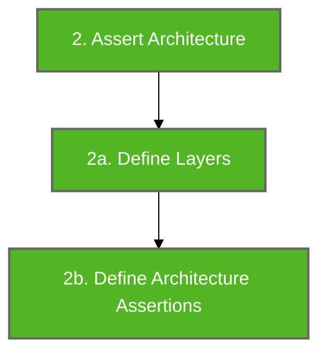
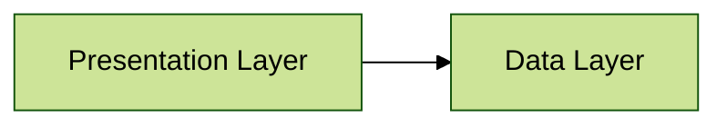

# Architecture Assert

Architecture assertions are used to perform architecture verification. It is the final step of Konsist verification preceded by scope creation ([koscope.md](koscope.md "mention")):



## Assert Architecture

As an example this simple 2 layer architecture will be used:



The `assertArchitecture` block defines architecture layer rules and verifies that the layer requirements are met.

```kotlin
Konsist
    .scopeFromProject()
    .assertArchitecture { // Assert architecture

    }
```

## Define Layers

Create layers instances to represent project layers. Each `Layer` instance accepts the `name` (used for presenting architecture violation errors) and `package` used to define layers.

```kotlin
Konsist
    .scopeFromProject()
    .assertArchitecture {
        // Define layers
        val presentation = Layer("Presentation", "com.myapp.presentation..")
        val data = Layer("Data", "com.myapp.data..")
    }
```

The `com.myapp.presentation..` syntax means every class inside `com.myapp.presentation` and all sub-packages are treated as part of the given layer.

## Define Architecture Assertions

The final step is to define the relations between each layer:

```kotlin
koScope.assertArchitecture {
        val presentation = Layer("Presentation", "com.myapp.presentation..")
        val data = Layer("Data", "com.myapp.data..")

        presentation.dependsOn(data)
        data.dependsOnNothing()
    }
```

## Additional Variable

Architecture configuration can be defined beforehand and stored in a variable to facilitate checks for multiple scopes:&#x20;

```kotlin
// Define architecture
val architecture = architecture {
        val presentation = Layer("Presentation", "com.myapp.presentation..")
        val data = Layer("Data", "com.myapp.data..")

        presentation.dependsOn(data)
        data.dependsOnNothing()
}

// Assert Architecture of two modules using common architecture rules
moduleFeature1Scope.assertArchitecture(architecture)
moduleFeature2Scope.assertArchitecture(architecture)
```

This approach may be helpful when refactoring existing applications. To facilitate readability the above checks should be expressed as two unit tests:

```kotlin
class ArchitectureTest {
    private val architecture = architecture {
        val presentation = Layer("Presentation", "com.myapp.presentation..")
        val data = Layer("Data", "com.myapp.data..")

        presentation.dependsOn(data)
        data.dependsOnNothing()
    }

    @Test
    fun `architecture layers of feature1 module have dependencies correct`() {
        moduleFeature1Scope.assertArchitecture(architecture)
    }
    
    @Test
    fun `architecture layers of feature2 module have dependencies correct`() {
        moduleFeature2Scope.assertArchitecture(architecture)
    }
}
```

##
