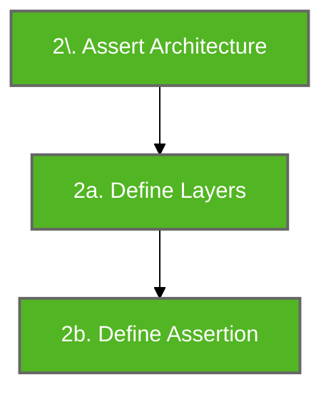
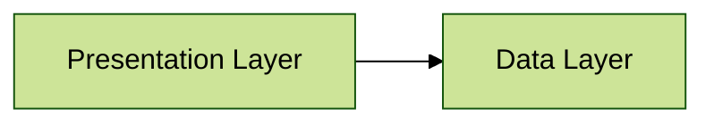

# Architecture Assertion

Architecture assertions are used to perform architecture verification. It is the final step of Konsist verification preceded by scope creation ([koscope.md](koscope.md "mention")):



## Assert Architecture

As an example, this simple 2-layer architecture will be used:



The `assertArchitecture` block defines architecture layer rules and verifies that the layer requirements are met.

```kotlin
Konsist
    .scopeFromProject()
    .assertArchitecture { 
        // Assert architecture 
    }
```

## Define Layers

Create [Layer](https://lemonappdev.github.io/konsist/-konsist%200.17.0/com.lemonappdev.konsist.api.architecture/-layer/index.html?query=data%20class%20Layer\(name:%20String,%20rootPackage:%20String\)) class instance to represent project layers. Each `Layer` instance accepts the `name` (used for presenting architecture violation errors) and `package` used to define architectural layer:

```kotlin
Konsist
    .scopeFromProject()
    .assertArchitecture {
        // Define layers
        val presentation = Layer("Presentation", "com.myapp.presentation..")
        val data = Layer("Data", "com.myapp.data..")
    }
```


The inclusion of two trailing dots indicates that the layer is denoted by the `com.myapp.business` package together with all of its sub-packages.


## Define Architecture Assertions

The final step is to define the dependencies (relations) between each layer using one of these methods:

* `dependsOn`
* `dependsOnNothing`
* `doesNotDependOn`


See the [language reference](https://lemonappdev.github.io/konsist/-konsist%200.17.0/com.lemonappdev.konsist.api.architecture/-layer-dependencies/index.html) for above methods.


The above methods follow up the layer definitions inside `assertArchitecture` block:

```kotlin
Konsist
    .scopeFromProject()
    .assertArchitecture {
        val presentation = Layer("Presentation", "com.myapp.presentation..")
        val data = Layer("Data", "com.myapp.data..")

        // Define dependencies 
        presentation.dependsOn(data)
        data.dependsOnNothing()
    }
```

## Strict DependsOn

By default `dependsOn` method works like does not perform strict layer validation (`strict = false`).  However this behaviour is controlled b y`strict` parameter:

* `strict = false` (default) - may depend on layer
* `strict = true`  - have to depend on layer

e.g.

```kotlin
// Optional dependency - Feature layer may depend on Domain layer
featureLayer.dependsOn(domainLayer) // strict = false by default

// Required dependency - Feature layer must depend on Domain layer
featureLayer.dependsOn(domainLayer, strict = true)
```

## Excluding Files

Architecture verification can be performed on `KoScope` (as seen above) and a list containing `KoFiles`.  For example, you can remove a few files from the scope before performing an architectural check:

```kotlin
Konsist
    .scopeFromProject()
    .files
    .withNameStartingWith("Repository")
    .assertArchitecture {
        val presentation = Layer("Presentation", "com.myapp.presentation..")
        val data = Layer("Data", "com.myapp.data..")

        presentation.dependsOn(data)
        data.dependsOnNothing()
    }
```

This approach provides more flexibility when working with complex projects, however, The desired approach is to create a dedicated scope. See [koscope.md](koscope.md "mention").

## Include Layer Without Defining Dependency

The [include](https://lemonappdev.github.io/konsist/-konsist%200.17.0/com.lemonappdev.konsist.api.architecture/-layer-dependencies/include.html) method allows to include layer in architecture verification, without defining a dependency for this layer:

```kotlin
private val domain = Layer("Domain",  "com.domain..")
private val presentation = Layer("Presentation", "com..presentation..")

Konsist
    .scopeFromProject()
    scope.assertArchitecture {
        // Include presentation for architectural check without defining a dependency
        presentation.include()
        
        // Include domain layer or architectural check and define no dependency (independent)
        domain.doesOnNothing()
    }
}
```

## Architecture As A Variable

Architecture configuration can be defined beforehand and stored in a variable to facilitate checks for multiple scopes:&#x20;

```kotlin
// Define architecture
val architecture = architecture {
        val presentation = Layer("Presentation", "com.myapp.presentation..")
        val data = Layer("Data", "com.myapp.data..")

        presentation.dependsOn(data)
        data.dependsOnNothing()
}

// Assert Architecture of two modules using common architecture rules
moduleFeature1Scope.assertArchitecture(architecture)
moduleFeature2Scope.assertArchitecture(architecture)
```

This approach may be helpful when refactoring existing applications. To facilitate readability the above checks should be expressed as two unit tests:

```kotlin
class ArchitectureTest {
    private val architecture = architecture {
        val presentation = Layer("Presentation", "com.myapp.presentation..")
        val data = Layer("Data", "com.myapp.data..")

        presentation.dependsOn(data)
        data.dependsOnNothing()
    }

    @Test
    fun `architecture layers of feature1 module have dependencies correct`() {
        moduleFeature1Scope.assertArchitecture(architecture)
    }
    
    @Test
    fun `architecture layers of feature2 module have dependencies correct`() {
        moduleFeature2Scope.assertArchitecture(architecture)
    }
}
```

