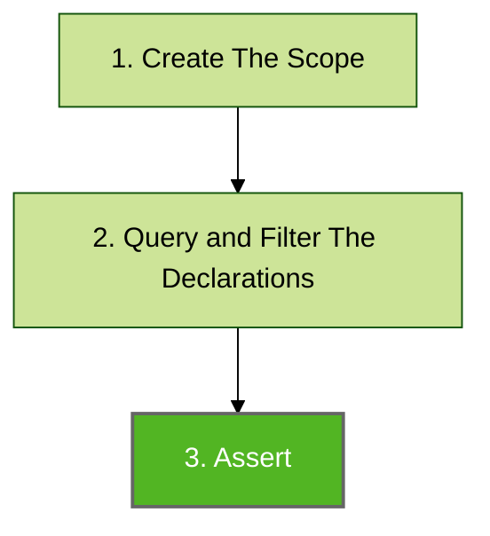

# Assert

Assertions are used to perform code base verification. It is the final step of Konsist verification preceded by scope retrieval ([koscope.md](koscope.md "mention")) and [query-and-filter-declarations.md](query-and-filter-declarations.md "mention") steps:



## Assert

> **_@Deprecated:_**  will be removed in version v1.0.0
> 
> Please use `.assertTrue`. See example below.

In the below snippet, the assertion (performed on the list of interfaces) verifies if every interface has a `public` visibility modifier.

```kotlin
koScope
    .interfaces()
    .assertTrue { it.hasPublicModifier() }
```

The `it` parameter inside the `assert` the method represents a single declaration (single interface in this case). However, the assertion itself will be performed on every available interface.&#x20;

## AssertTrue

In the below snippet, the assertion (performed on the list of interfaces) verifies if every interface has a `public` visibility modifier.

```kotlin
koScope
    .interfaces()
    .assertTrue { it.hasPublicModifier() }
```

The `it` parameter inside the `assert` the method represents a single declaration (single interface in this case). However, the assertion itself will be performed on every available interface.&#x20;

## Assert Not

> **_@Deprecated:_**  will be removed in version v1.0.0
>
> Please use `.assertFalse`

The `assertNot` is a negation of the `assert` method. In the below snippet, the assertion (performed on the list of properties) verifies if none of the properties has the `Inject` annotation:

```kotlin
koScope
    .classes()
    .flatMap { it.properties() }
    .assertFalse { it.hasAnnotationOf<Inject>() }
```

## Assert False

The `assertFalse` is a negation of the `assertTrue` method. In the below snippet, the assertion (performed on the list of properties) verifies if none of the properties has the `Inject` annotation:

```kotlin
koScope
    .classes()
    .flatMap { it.properties() }
    .assertFalse { it.hasAnnotationOf<Inject>() }
```

## Exceptions Thrown

The assertions:
- `assert (@Deprecated)` 
- `assertTrue`
- `assertNot (@Deprecated)`
- `assertFalse`

methods throw:

* `KoCheckFailedException` - if the assertion criteria are not met. The error message contains a descriptive location, pointing to the exact spot in the codebase
* `KoPreconditionFailedException` - if the assertion is performed on an empty list
