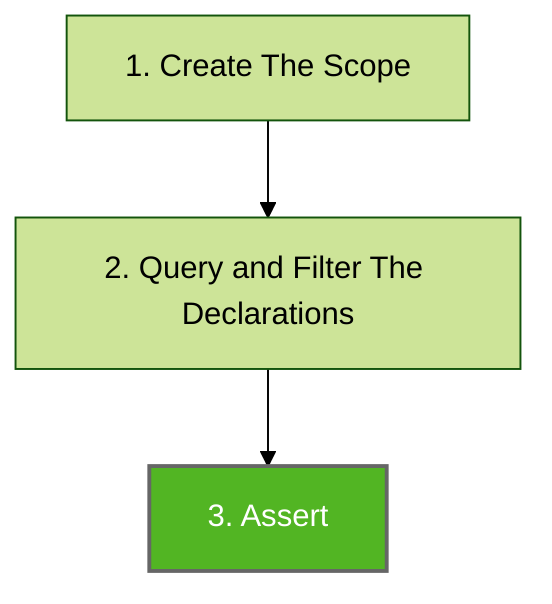

# Declaration Assert

Assertions are used to perform code base verification. This is the final step of Konsist verification preceded by scope creation ([koscope.md](koscope.md "mention")) and [declaration-query-and-filter.md](declaration-query-and-filter.md "mention") steps:



## Assert

> **_@Deprecated:_**  will be removed in version v1.0.0
>
> Please use `.assertTrue`. See example below.

In the below snippet, the assertion (performed on the list of interfaces) verifies if every interface has a `public` visibility modifier.

```kotlin
koScope
    .interfaces()
    .assert { it.hasPublicModifier() }
```

The `it` parameter inside the `assert` the method represents a single declaration (single interface in this case). However, the assertion itself will be performed on every available interface. The last line in the `assert` block will be evaluated as `true` or `false` providing the result for a given assert.

## Assert True

> **_@Deprecated:_**  will be removed in version v1.0.0
>
> Please use `.assertTrue`. See example below.

In the below snippet, the assertion (performed on the list of interfaces) verifies if every interface has a `public` visibility modifier.

```kotlin
koScope
    .interfaces()
    .assertTrue { it.hasPublicModifier() }
```

The `it` parameter inside the `assertTrue` the method represents a single declaration (single interface in this case). However, the assertion itself will be performed on every available interface. The last line in the `assertTrue` block will be evaluated as `true` or `false` providing the result for a given assert.


## Assert Not

> **_@Deprecated:_**  will be removed in version v1.0.0
>
> Please use `.assertTrue`. See example below.

The `assertNot` is a negation of the `assert` method. In the below snippet, the assertion (performed on the list of properties) verifies if none of the properties has the `Inject` annotation:

```kotlin
koScope
    .classes()
    .properties()
    .assertNot { it.hasAnnotationOf<Inject>() }
```

This assertion verifies that the class does not contain any properties with `public` (explicit `public` modifier) or default (implicit `public` modifier) modifiers:

```
koScope
    .classes()
    .assertNot { 
        it.containsProperty { 
            property -> property.hasPublicOrDefaultModifier 
        } 
    }
```

## Assert False

The `assertFalse` is a negation of the `assertTrue` method. In the below snippet, the assertion (performed on the list of properties) verifies if none of the properties has the `Inject` annotation:

```kotlin
koScope
    .classes()
    .properties()
    .assertFalse { it.hasAnnotationOf<Inject>() }
```

This assertion verifies that the class does not contain any properties with `public` (explicit `public` modifier) or default (implicit `public` modifier) modifiers:

```
koScope
    .classes()
    .assertFalse { 
        it.containsProperty { 
            property -> property.hasPublicOrDefaultModifier 
        } 
    }
```
