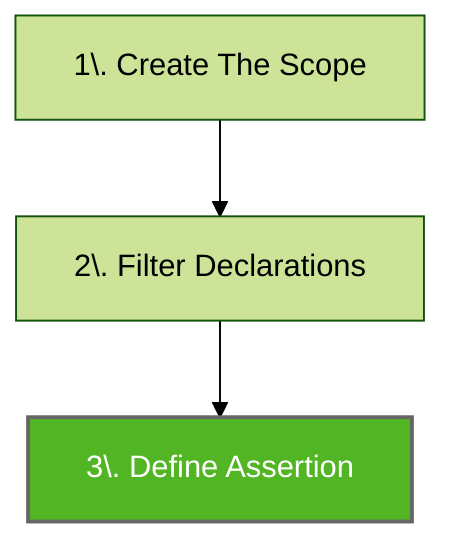

# Declaration Assertion

Assertions are used to perform code base verification. This is the final step of Konsist verification preceded by scope creation ([koscope.md](koscope.md "mention")) and [declaration-query-and-filter.md](declaration-query-and-filter.md "mention") steps:




## Assertion Methods

Konsist offers a variety of assertion methods. These can be applied to a list of KoDeclarations as well as a single declaration.

### Assert True

In the below snippet, the assertion (performed on the list of interfaces) verifies if every interface has a `public` visibility modifier.

```kotlin
koScope
    .interfaces()
    .assertTrue { it.hasPublicModifier() }
```

The `it` parameter inside the `assertTrue` method represents a single declaration (single interface in this case). However, the assertion itself will be performed on every available interface. The last line in the `assertTrue` block will be evaluated as `true` or `false` providing the result for a given asset.


Each `KoDeclaration` comes with an API, comprising methods and properties, for verifying the declaration. Additionally, the Konsist API offers a `text` property for exceptional cases where the standard API falls short. This should be used as a last resort, and any issues encountered should be reported [getting-help.md](../help/getting-help.md "mention").


### Assert False

The `assertFalse` is a negation of the `assertTrue` method. In the below snippet, the assertion (performed on the list of properties) verifies if none of the properties has the `Inject` annotation:

```kotlin
Konist
    .scopeFromProject()
    .properties()
    .assertFalse { 
        it.hasAnnotationOf(Inject::class)
    }
```

This assertion verifies that the class does not contain any properties with `public` (an explicit `public` modifier) or default (implicit `public` modifier) modifiers:

```kotlin
Konist
    .scopeFromProject()
    .properties()
    .assertFalse { 
        it.hasPublicOrDefaultModifier
    }
```

### Assert Empty

This assertion helps to verify if the given list of declarations is empty.&#x20;

```kotlin
Konist
    .scopeFromProject()
    .classes()
    .assertEmpty()
```

### Assert Not Empty

This assertion helps to verify if the given list of declarations is not empty.&#x20;

```kotlin
Konist
    .scopeFromProject()
    .classes()
    .assertNotEmpty()
```

## Assertion Parameters

### Test Name

Assertions offer a set of parameters allowing to tweak the assertion behavior. You can adjust several settings, such as setting `testName` that helps with suppression (see [suppressing-konsist-test.md](suppressing-konsist-test.md "mention")).

### Strict

You can also enable enhanced verification by setting  `strict` argument to `true`:

```kotlin
Konist
    .scopeFromProject() 
    .classes()
    .assertFalse(strict = true) { ... }
```

### Additional Message

The `additionalMessage` param allows to provision of additional messages that will be displayed with the failing test. This may be a more detailed description of the problem or a hint on how to fix the issue.

```kotlin
Konist
    .scopeFromProject() 
    .classes()
    .assertFalse(additionalMessage = "Do X to fix the issue") { ... }
```
