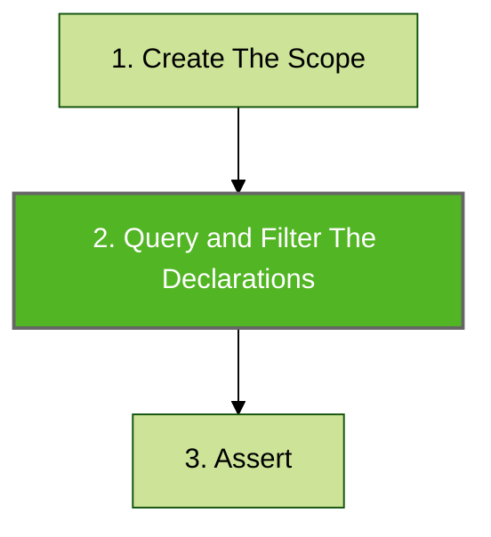

# Declaration Query And Filter

## Declaration Querying

Declaration querying allows to retrieval of declarations of a given type. It is the middle step of the Konsist config preceded by scope retrieval ([koscope.md](koscope.md "mention")) and followed by the verification ([declaration-assert.md](declaration-assert.md "mention")) step.



Typically, verification has performed a collection of declarations such as methods marked with particular annotations or classes located within a single package.

Every [koscope.md](koscope.md "mention") contains a set of declarations ([declaration.md](../features/declaration.md "mention")) such as classes (`KoClass`), properties (`KoProperty`), functions (`KoFunction`), etc. The `KoScope` class provides a set of methods to access Kotlin declarations. Each method returns a list representing a declaration subset:

|                      |                                                    |
|----------------------|----------------------------------------------------|
| Method               | Description                                        |
| `files()`            | returns all files present in the scope             |
| `packages()`         | returns all packages present in the scope          |
| `imports()`          | returns all imports present in the scope           |
| `classes()`          | returns all classes present in the scope           |
| `interfaces()`       | returns all interfaces present in the scope        |
| `objects()`          | returns all objects present in the scope           |
| `functions()`        | returns all functions present in the scope         |
| `properties()`       | returns all properties present in the scope        |
| `companionObjects()` | returns all companion objects present in the scope |
| `typeAliases()`      | returns all type aliases present in the scope      |
| `declarations()`     | returns all declarations present in the scope      |

To get all classes from the given scope use `KoScope.classes()` method:

```kotlin
koScope
    .classes()
```

Here is an example of querying all properties defined inside classes:

```kotlin
    koScope
        .classes()
        .properties()
        .assertTrue { 
            //...
        }
```

## Filter Declarations

More granular filtering can be applied to additionally filter classes annotated with certain attributes like classes annotated with `UseCase` annotation.

Konsist is compatible with [Kotlin Collection processing](https://kotlinlang.org/docs/collections-overview.html#list) API, so the `filter` method can be used to filter the content of the `List<KoClass>`: Here filter return classes annotated with `UseCase` annotation:

```kotlin
koScope
    .classes()
    .filter { it.hasAnnotationOf<UseCase>() }
    .assertTrue { 
        //... 
    }
```

Konsist provides a set of `with...` extensions to simplify the filtering syntax. The above snippet can be improved:

```kotlin
koScope
    .classes()
    .withAllAnnotationsOf(UseCase::class)
    .assertTrue { 
        //...
    }
```


The`.`**`withAllAnnotationsOf`**`(Annotation1::class, Annotation2::class)` filter classes heaving all annotations present (`Annotation1` **and** `Annotation2`).&#x20;

The`.`**`withSomeAnnotationsOf`**`(Annotation1::class, Annotation2::class) filter`classes  heaving`at least one annotation` (`Annotation1` **or** `Annotation2`)`.`


Multiple conditions can be chained to perform more specific filtering. The below snippet filters classes with the `BaseUseCase` parent class that resides in the `usecase` package:&#x20;

```kotlin
koScope
    .classes()
    .withAllAnnotationsOf(UseCase::class)
    .resideInPackage("..usecase")
    .assertTrue { 
        //...
    }
```

It is also possible to filter declarations by using certain aspects e.g. visibility modifiers. Usage of `providers` allows verifying the visibility of different declaration types such as classes, functions, properties, etc:

```kotlin
koScope
    .declarations()
    .declarations<KoVisibilityModifierProvider>()
    .assertTrue { it.hasInternalModifier() }
```

## Query And Filter Declaration

Queuing and filtering stages can be mixed to perform more specific checks. The below snippet filters classes reside in the `controller` package retrieves all properties, and filters properties with `Inject` annotation:

```kotlin
koScope
    .classes() // query all classes
    .resideInPackage("..controller") // filter classes in 'controller' package
    .properties()  // query all properties
    .withAnnotationOf<Inject>() // filter classes in 'controller' package
    .assert { 
        //...
    }
```

## Print Declarations

To print all declarations within use the `print()` method:

```kotlin
koScope
    .classes()
    .properties()
    .print()
```
