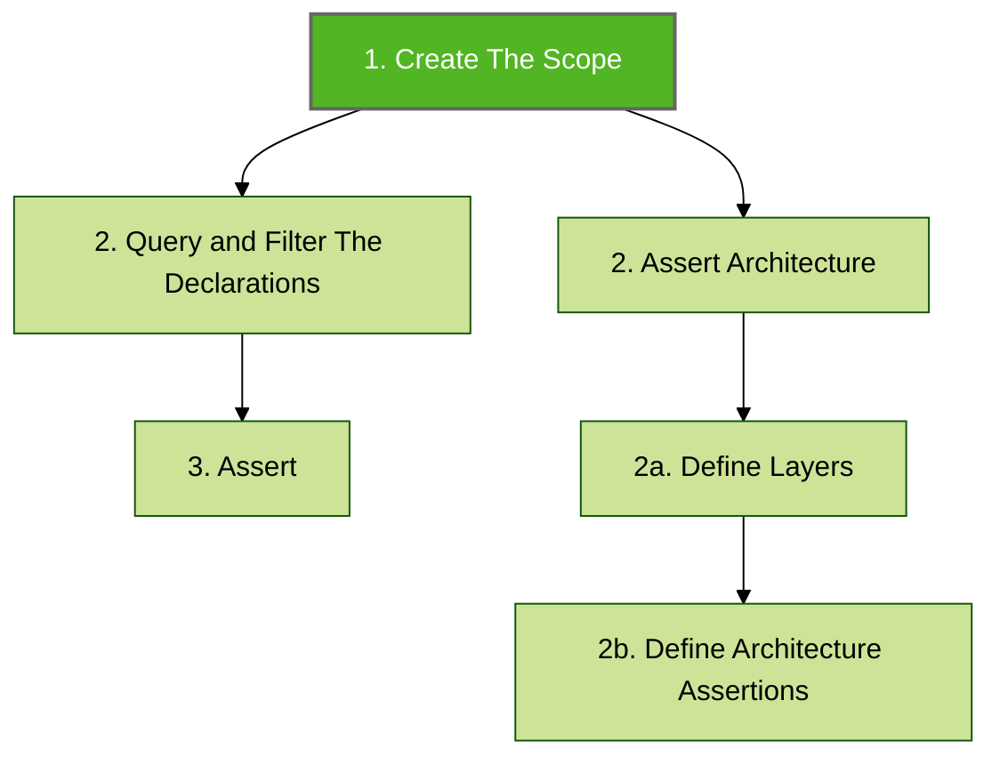
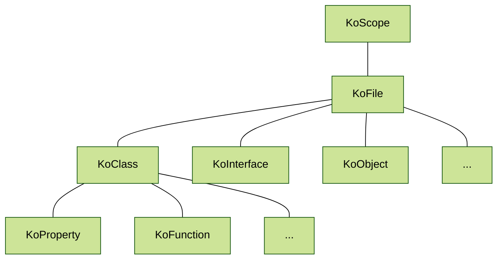

# Create The Scope

Scope represents a set of Kotlin files to be further queried, filtered ([declaration-query-and-filter.md](declaration-query-and-filter.md "mention")), and verified ([declaration-assert.md](declaration-assert.md "mention")).



Every scope contains a set of `KoFile` instances. Every `KoFile` instance contains the declarations (see [declaration.md](../features/declaration.md "mention")) representing code entities present in the file e.g.:




Konsist is built on top of [Kotlin Compiler Psi](https://github.com/JetBrains/kotlin/tree/master/compiler/psi/src/org/jetbrains/kotlin/psi). It wraps the Kotlin compiler parser and provides a simple API to access Kotlin code base declarations. Konsist [declaration.md](../features/declaration.md "mention") tree mimics the Kotlin code structure:


The scope can be created for an entire project, module, package, and Kotlin file.

The scope is dynamically built based on the Kotlin files present in the project, enabling it to adapt seamlessly as the project evolves. For instance, when the scope is set to encapsulate a specific module, any additional file introduced to that module will be automatically incorporated into the scope. This ensures that the scope consistently offers thorough and current coverage.


To execute Konsist tests, the Konsist dependency must be integrated into a module. Yet, by integrating Konsist into a single module (e.g. `app` module), Konsist can still access the entire project. The specific files evaluated are determined by the evolving scope that's been defined.


## Scope Creation

Various methods can be used to obtain instances of the scope. This allows the definition of more granular Konsist tests e.g. tests covering only certain modules, source sets, packages, or folders.


See [add-konsist-existing-project.md](../getting-started/getting-started/add-konsist-existing-project.md "mention").


### Project Scope

The widest scope is the scope containing all Kotlin files present inside the project:

```kotlin
Konsist.scopeFromProject() // All Kotlin files present in the project
```

To print a list of files within `koScope` use the `koScope.print()` method:

```kotlin
Konsist
    .scopeFromProject()
    .print()
```


To review the scope content in more detail see [debug-konsist-test.md](../features/debug-konsist-test.md "mention").


### Module Scope

The `scopeFromModule` method allows the creation of more granular scopes based on the module name e.g. creating a scope containing all Kotlin files present in the `app` module:

```kotlin
Konsist.scopeFromModule("app")
```

Selection:

```
project/
├─ app/   <--- scope contains all files from the 'app' module
│  ├─ main/
│  │  ├─ App.kt
│  ├─ test/
│  │  ├─ AppTest.kt
├─ core/
│  ├─ main/
│  │  ├─ Core.kt
│  ├─ test/
│  │  ├─ CoreTest.kt
```

This approach may be helpful when refactoring existing project modules by module.

```
val refactoredModule1Scope = Konsist.scopeFromModule("refactoredModule1")
val refactoredModule1Scope = Konsist.scopeFromModule("refactoredModule2")

val scope = refactoredModule1Scope + refactoredModule1Scop2

scope
   .classes()
   ...
   .assertTrue { /*..*/ }
```

### Nested Module Scope

A nested module is a module that exists within another module.


The `nested modules` the feature is not complete. The community is reporting that this feature works, however, we still have to take a closer look, review expectations, and add tests. COnsider this feature as experimental for now.


Consider this `feature` module existing inside `app` module:

```
project/
├─ app/   <--- scope contains all files from the 'app' module
│  ├─ feature/
│  │  ├─ Feature.kt
```

To narrow the scope to `feature` module use:

```kotlin
Konsist.scopeFromModule("app/feature")
```

### Source Set Scope

The `scopeFromSourceSet` method argument allows the creation of more granular scopes based on the source set name e.g. create a scope containing all Kotlin files present in the `test` source set:

```kotlin
Konsist.scopeFromSourceSet("test")
```

Selection:

```
project/
├─ app/
│  ├─ main/
│  │  ├─ App.kt
│  ├─ test/   <--- scope contains all files the 'test' directory
│  │  ├─ AppTest.kt
├─ core/
│  ├─ main/
│  │  ├─ Core.kt
│  ├─ test/   <--- scope contains all files the 'test' directory
│  │  ├─ CoreTest.kt
```

### Module and Source Set Scope

To retrieve scope by using both module and source set use the `scopeFromProject` method with `moduleName` and `sourceSetName` arguments:

```
Konsist.scopeFromProject(moduleName = "app", sourceSetName = "test)
```

### Selection:

```

project/
├─ app/
│  ├─ main/
│  │  ├─ App.kt
│  ├─ test/   <--- scope contains all files the 'test' directory
│  │  ├─ AppTest.kt
├─ core/
│  ├─ main/
│  │  ├─ Core.kt
│  ├─ test/
│  │  ├─ CoreTest.kt
```

### Production Codebase

The `scopeFromProduction` method allows the creation of a scope containing only a production code:

```kotlin
Konsist.scopeFromProduction()
```

Selection:

```
project/
├─ app/
│  ├─ main/   <--- scope contains all production code files
│  │  ├─ App.kt
│  ├─ test/
│  │  ├─ AppTest.kt
├─ core/
│  ├─ main/   <--- scope contains all production code files
│  │  ├─ Core.kt
│  ├─ test/
│  │  ├─ CoreTest.kt
```

### Test Codebase

The `scopeFromTest` method allows the creation of a scope containing only a test code:

```kotlin
Konsist.scopeFromTest()
```

Selection:

```
project/
├─ app/
│  ├─ main/
│  │  ├─ App.kt
│  ├─ test/   <--- scope contains all test code files
│  │  ├─ AppTest.kt
├─ core/
│  ├─ main/
│  │  ├─ Core.kt
│  ├─ test/   <--- scope contains all test code files
│  │  ├─ CoreTest.kt
```

### Package Scope

The `sourceFromPackage` method allows the creation of a scope containing code present in a given package e.g. `com.usecase` package:

```kotlin
Konsist.sourceFromPackage("com.usecase..")
```

Selection:

```
project/
├─ app/
│  ├─ main/
│  │  ├─ com/
│  │  │  ├─ usecase/
│  │  │  │  ├─ UseCase.kt <--- scope contains files present from 'com.usecase' package kon
│  ├─ test/
│  │  ├─ com/
│  │  │  ├─ usecase/
│  │  │  │  ├─ UseCaseTest.kt <--- scope contains files present from 'com.usecase' package
```


The double dots (`..`) syntax means zero or more packages. Check the [packageselector.md](../features/packageselector.md "mention") page.


### Directory Scope

The `scopeFromDirectory` method allows the creation of a scope containing code present in a given project folder e.g. `domain` directory:

```kotlin
val myScope = Konsist.scopeFromDirectory("app/domain")
```

Selection:

```
project/
├─ app/
│  ├─ main/
│  │  ├─ com/
│  │  │  ├─ domain/  <--- scope contains files present in 'domain' folder
```

## File Scope

It is also possible to create scope from one or more file paths:

```kotlin
val myScope = Konsist.scopeFromFile("app/main/domain/UseCase.kt")
```

We have added a new way of creating the scope from a list of files. This can help with certain development workflows e.g. runing Konsist Tests only on files modified in a given PR:

```kotlin
val filePaths = listOf("/domain/UseCase1.kt", "/domain/UseCase2.kt")
val myScope = Konsist.scopeFromFile(filePaths)
```

## Scope Slice

For even more granular control you can use the `KoScope.slice` method to retrieve a scope containing a subset of files from the given scope:

```kotlin
// scope containing all files in the 'test' folder
koScope.slice { it.relativePath.contains("/test/") }

// scope containing all files in 'com.domain.usecase' package
koScope.slice { it.hasImport("com.domain.usecase") }

// scope containing all files in 'usecase' package and its sub-packages
koScope.slice { it.hasImport("usecase..") }
```

The `KoScope` can be printed to display a list of all files present in the scope. Here is an example:

## Scope Reuse

### Reuse Scope In Test Class

To reuse scope across the test class define the scope in the companion object and access it from multiple tests:

<pre class="language-kotlin"><code class="lang-kotlin">// Test.kt
class DataTest {
<strong>    @Test
</strong>    fun `test 1`() {
        projectScope
            .assertTrue { // .. } 
    }

    fun `test 2`() {
        projectScope
            .assertTrue { // .. } 
    }
    
    companion object {
        // Create a new KoScope once for all tests
        private val classesScope = Konsist
            .scopeFromProject()
            .classes()
    }
}
</code></pre>

### Reuse Scope In Test Source Set

To reuse scope across the multiple test classes define the scope in the file and access it from multiple test classes:

```kotlin
// Scope.kt is "test" source set
val projectScope = Konsist.scopeFromProject() // Create a new KoScope

// AppTest.kt
class AppKonsistTest {
    @Test
    fun `test 1`() {
        projectScope
            .objects()
            .assertTrue { // .. }
    }
}

// DataTest.kt
class CoreKonsistTest {
    @Test
    fun `test 1`() {
        projectScope
            .classes()
            .assertTrue { // .. }
    }

    fun `test 2`() {
        projectScope
            .interfaces()
            .assertTrue { // .. }
    }
}
```

Here is the file structure representing the above snippet:

```
project/
├─ app/
│  ├─ test/
│  │  ├─ app
│  │     ├─ AppKonsistTest.kt
│  │  ├─ core
│  │     ├─ CoreKonsistTest.kt
│  │  ├─ Scope.kt   <--- Instance of the KoScope used in both DataTest and AppTest classes.
```

## Scope Composition

Konsist scope supports [Kotlin Operator overloading](https://kotlinlang.org/docs/operator-overloading.html), so copes can be further combined together to create the desired scope, tailored to project needs. In this example scopes from `myFeature1` module and `myFeature2` module are combined together:

```kotlin
val featureModule1Scope = Konsist.scopeFromModule("myFeature1")
val featureModule2Scope = Konsist.scopeFromModule("myFeature2")

val refactoredModules = featureModule1Scope + featureModule2Scope

refactoredModules
    .classes()
    ...
    .assertTrue { ... }
```

Scope subtraction is also supported, so it is possible for example to exclude a part of a given module. Here scope is created from `myFeature` module and then the `..data..` package is excluded:

```kotlin
val moduleScope = Konsist.scopeFromModule("myFeature")
val dataLayerScope = Konsist.scopeFromPackage("..data..")

val moduleSubsetScope = moduleScope - dataLayerScope

moduleSubsetScope
    .classes()
    ...
    .assertTrue { ... }
```

## Print Scope

To print all files within the scope use the `print()` method:

```kotlin
koScope.print()
```


See [debug-konsist-test.md](../features/debug-konsist-test.md "mention").


## Access Specific Declarations

To access specific declaration types such as interfaces, classes, constructors, functions, etc. utilize the [declaration-query-and-filter.md](declaration-query-and-filter.md "mention").
