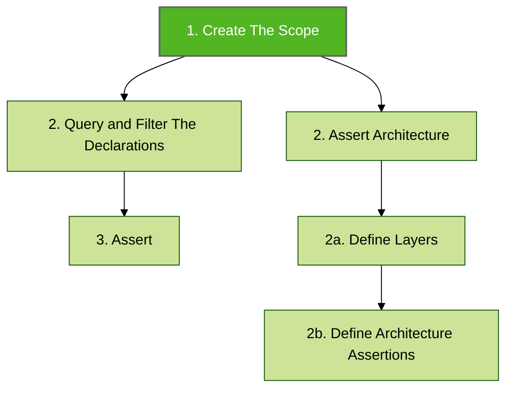
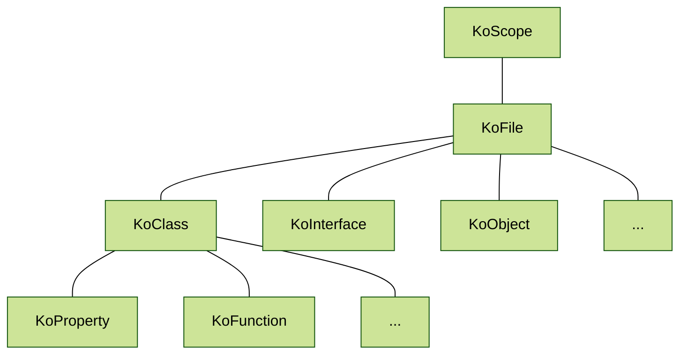

# Create The Scope

The [KoScope](https://github.com/LemonAppDev/konsist/blob/main/src/main/kotlin/com/lemon/konsist/core/declaration/KoScope.kt) class is the entry point to the Konsist library. It is the initial step in defining the Konsist test. Scope represents a set of Kotlin files to be further queried, filtered ([declaration-query-and-filter.md](declaration-query-and-filter.md "mention")), and verified ([declaration-assert.md](declaration-assert.md "mention")).



Every scope contains a set of `KoFile` instances. Every `KoFile` instance contains the declarations (see [declaration.md](../features/declaration.md "mention")) representing code entities present in the file e.g.:




Konsist is built on top of [Kotlin Compiler Psi](https://github.com/JetBrains/kotlin/tree/master/compiler/psi/src/org/jetbrains/kotlin/psi). It wraps the Kotlin compiler parser and provides a simple API to access Kotlin code base declarations. Konsist  [declaration.md](../features/declaration.md "mention") tree mimics the Kotlin code structure:


The scope can be created for an entire project, module, package, and a single Kotlin file.&#x20;


To print a list of files within `koScope` use the `koScope.print()` method.


The scope is dynamically constructed from the Kotlin files within the project, allowing it to naturally expand as the project grows. For example, if the scope is defined to represent a single module, then any new file added to that module will be automatically included within the scope, ensuring that the scope's coverage remains comprehensive and up-to-date.

## Scope Creation

Various methods can be used to obtain instances of the scope. This allows the definition of more granular Kotlist tests e.g. for certain modules, source sets, and packages of folders.


When refactoring application scope can be created for a single module to guard specific rules of the improved code base and then further extended to cover already refactored modules.


### Project Scope

The widest scope is the scope containing all Kotlin files present inside the project:

```kotlin
Konsist.scopeFromProject() // All Kotlin files present in the project
```

### Module Scope

The `scopeFromModule` method allows the creation of more granular scopes based on the module name e.g. creating a scope containing all Kotlin files present in the `app` module:

```kotlin
Konsist.scopeFromModule("app")
```

Selection:

```
project/ 
├─ app/   <--- scope contains all files from the 'app' module
│  ├─ main/
│  │  ├─ App.kt
│  ├─ test/
│  │  ├─ AppTest.kt
├─ core/
│  ├─ main/
│  │  ├─ Core.kt
│  ├─ test/
│  │  ├─ CoreTest.kt
```

### Nested Module Scope

A nested module is a module that exists within another module.


The `nested modules` the feature is not complete. The community is reporting that this feature works, however, we still have to take a closer look, review expectations, and add tests.


Consider this `feature` module existing inside `app` module:

```
project/ 
├─ app/   <--- scope contains all files from the 'app' module
│  ├─ feature/
│  │  ├─ Feature.kt
```

To narrow the scope to `feature` module use:

```kotlin
Konsist.scopeFromModule("app/feature")
```

### Source Set Scope

The `scopeFromSourceSet` method argument allows the creation of more granular scopes based on the source set name e.g. create a scope containing all Kotlin files present in the `test` source set:

```kotlin
Konsist.scopeFromSourceSet("test")
```

Selection:

```
project/ 
├─ app/
│  ├─ main/
│  │  ├─ App.kt
│  ├─ test/   <--- scope contains all files the 'test' directory
│  │  ├─ AppTest.kt
├─ core/
│  ├─ main/
│  │  ├─ Core.kt
│  ├─ test/   <--- scope contains all files the 'test' directory
│  │  ├─ CoreTest.kt
```

### Module and Source Set Scope

To retrieve scope by using both module and source set use the `scopeFromProject` method with `moduleName` and `sourceSetName` arguments:

```
Konsist.scopeFromProject(moduleName = "app", sourceSetName = "test)
```

### Selection:

```

project/ 
├─ app/
│  ├─ main/
│  │  ├─ App.kt
│  ├─ test/   <--- scope contains all files the 'test' directory
│  │  ├─ AppTest.kt
├─ core/
│  ├─ main/
│  │  ├─ Core.kt
│  ├─ test/
│  │  ├─ CoreTest.kt
```

### Production Codebase

The `scopeFromProduction` method allows the creation of a scope containing only a production code:

```kotlin
Konsist.scopeFromProduction()
```

Selection:

```
project/ 
├─ app/
│  ├─ main/   <--- scope contains all production code files
│  │  ├─ App.kt
│  ├─ test/
│  │  ├─ AppTest.kt
├─ core/
│  ├─ main/   <--- scope contains all production code files
│  │  ├─ Core.kt
│  ├─ test/
│  │  ├─ CoreTest.kt
```

### Test Codebase

The `scopeFromTest` method allows the creation of a scope containing only a test code:

```kotlin
Konsist.scopeFromTest()
```

Selection:

```
project/ 
├─ app/
│  ├─ main/
│  │  ├─ App.kt
│  ├─ test/   <--- scope contains all test code files
│  │  ├─ AppTest.kt
├─ core/
│  ├─ main/
│  │  ├─ Core.kt
│  ├─ test/   <--- scope contains all test code files
│  │  ├─ CoreTest.kt
```

### Package Scope

The `sourceFromPackage` method allows the creation of a scope containing code present in a given package e.g. `com.usecase` package:

```kotlin
Konsist.sourceFromPackage("com.usecase..")
```

Selection:

```
project/ 
├─ app/
│  ├─ main/
│  │  ├─ com/
│  │  │  ├─ usecase/
│  │  │  │  ├─ UseCase.kt <--- scope contains files present from 'com.usecase' package kon
│  ├─ test/
│  │  ├─ com/
│  │  │  ├─ usecase/
│  │  │  │  ├─ UseCaseTest.kt <--- scope contains files present from 'com.usecase' package
```


The double dots (`..`) syntax means zero or more packages. Check the [packageselector.md](../features/packageselector.md "mention") page.


### Directory Scope

The `scopeFromDirectory` method allows the creation of a scope containing code present in a given project folder e.g. `domain` directory:

```kotlin
val myScope = Konsist.scopeFromDirectory("app/domain")
```

Selection:

```
project/ 
├─ app/
│  ├─ main/
│  │  ├─ com/
│  │  │  ├─ domain/  <--- scope contains files present in 'domain' folder
```

## File Scope

It is also possible to create scope from a single file:

```kotlin
val myScope = Konsist.scopeFromFile("app/main/domain/UseCase.kt")
```

## Scope Slice

For even more granular control you can use the `KoScope.slice` method to retrieve a scope containing a subset of files from the given scope:

```kotlin
// scope containing all files in the 'test' folder
koScope.slice { it.relativePath.contains("/test/") }

// scope containing all files in 'com.domain.usecase' package
koScope.slice { it.hasImport("com.domain.usecase") }

// scope containing all files in 'usecase' package and its sub-packages
koScope.slice { it.hasImport("usecase..") }
```

The `KoScope` can be printed to display a list of all files present in the scope. Here is an example:

## Scope Reuse

### Scope Per Test Class

To reuse scope across the test class define the scope in the companion object and access it from multiple tests:

<pre class="language-kotlin"><code class="lang-kotlin">// Test.kt
class DataTest {
<strong>    @Test
</strong>    fun `test 1`() {
        projectScope
            .classes()
            .assert { // .. } 
    }

    fun `test 2`() {
        projectScope
            .classes()
            .assert { // .. } 
    }
    
    companion object {
        // Create a new KoScope once for all tests
        private val projectScope = Konsist.scopeFromProject()
    }
}
</code></pre>

### Global Per Test Source Set

To reuse scope across the multiple test classes define the scope in the file and access it from multiple tests classes:

```kotlin
// Scope.kt
val projectScope = Konsist.scopeFromProject() // Create a new KoScope

// AppTest.kt
class AppKonsistTest {    
    @Test
    fun `test 1`() {
        projectScope
            .objects()
            .assert { // .. } 
    }
}

// DataTest.kt
class CoreKonsistTest {    
    @Test
    fun `test 1`() {
        projectScope
            .classes()
            .assert { // .. } 
    }

    fun `test 2`() {
        projectScope
            .interfaces()
            .assert { // .. } 
    }
}
```

Here is the file structure representing the above snippet:

```
project/ 
├─ app/
│  ├─ test/
│  │  ├─ app
│  │     ├─ AppKonsistTest.kt
│  │  ├─ core
│  │     ├─ CoreKonsistTest.kt
│  │  ├─ Scope.kt   <--- Instance of the KoScope used in both DataTest and AppTest classes.
```

## Scope Composition

It is possible to compose scopes using Kotlin operators:

```kotlin
// add scopes
val allKoScope = productionScope + testScope

// subtract scopes
val outerLayersScope = allLayersScope - domainLayerScope
```

## Print Scope

To print all files within the scope use the `print()` method:

```kotlin
koScope.print()
```

## Access Specific Declarations

To access specific declaration types such as interfaces, classes, constructors, functions, etc. utilize the [declaration-query-and-filter.md](declaration-query-and-filter.md "mention").
